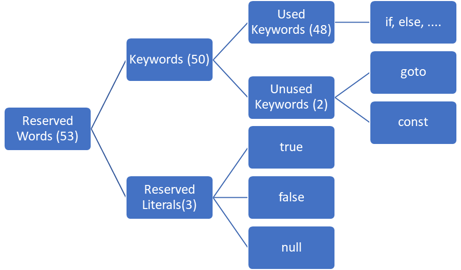
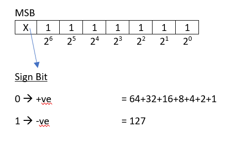
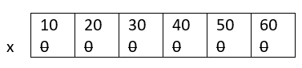
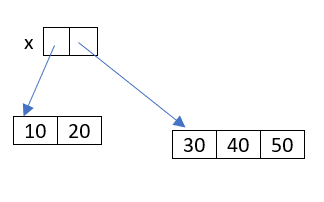
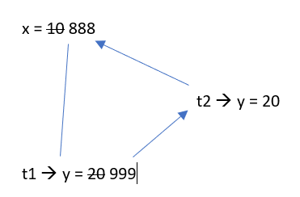
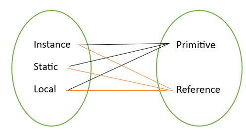
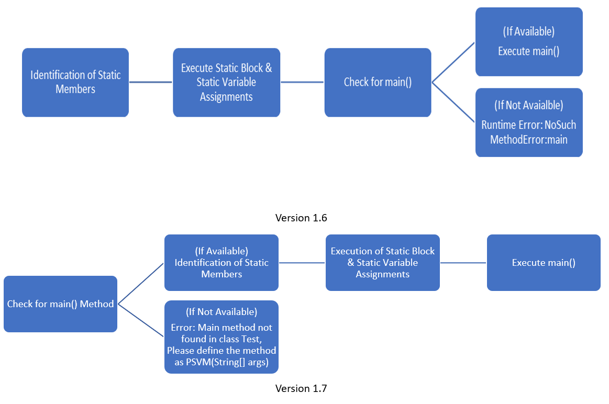

# Language Fundamentals
1. Identifiers
2. Reserved Words
3. Data Types
4. Literals
5. Arrays
6. Type Of Variables
7. var-arg Methods
8. main Method
9. Command Line Arguments
10. Java Coding Standards
---
# Identifiers
* A name in java program is considered as *Identifier* which can be *used for identification purpose*.
* It can be a *Class name, Method name, Variable name or Label name*.
```java
public class Temp {
    public static void main(String[] args) {
        int x = 10;
    }
}
```
>* *Temp* - Class name
>* *main* - Method name
>* *String* - Predefined Java Class name
>* *args* - Array name
>* *x* - Variable name

## Rules For Defining Java Identifiers
1. The only allowed characters in java identifiers are:
>* a to z
>* A to Z
>* 0 to 9
>* $
>* _

* If we are *using any other characters*, we will *get compile time error*.
>* total_number ✔  
>* total# ❌
2. *Identifiers can not starts with digit*.
>* total123 ✔  
>* 123total ❌
3. Java identifiers are *case sensitive*. Ofcourse, Java language itself is treated as *case sensitive programming language*.
```java
public class Temp {
    public static void main(String[] args) {
        int number = 10;
        int Number = 20;
        int NUMBER = 30; //We can differentiate with respect to case
    }
}
```
4. There is *no length limit for java identifiers*. But, it is *not recommended to take too lengthy identifiers*.
5. We *can not use reserved words as identifiers*.
```java
public class Temp {
    public static void main(String[] args) {
        int x = 10; ✔
        int if = 20; ❌
    }
}
 ```
6. All *predefined java class names and interface names* we can *use as identifiers*. 
```java
public class Temp {
    public static void main(String[] args) {
        int String = 10;
        System.out.println(String);
        int Runnable = 999;
        System.out.println(Runnable);
    }
}
```
* Even though it is *valid*, but it is *not a good programming practice*. Because, it *reduces readability and creates confusion*.

Q1. Which of the following are valid java identifiers
* total_number ✔
* total# ❌
* 123total ❌
* total123 ✔
* ca$h ✔
* $__$____$ ✔
* all@hands ❌
* Java2Share ✔
* Integer ✔
* Int ✔
* int ❌
---
# Reserved Words
* In java some *words are reserved to represent some meaning or functionality* are called *Reserved Words*.


## Keywords For Datatypes (8):
>* byte
>* short
>* int
>* long
>* float
>* double
>* boolean
>* char
## Keywords For Flow Control (11):
>* if
>* else
>* switch
>* case
>* default
>* while
>* do
>* for
>* break
>* continue
>* return
## Keywords For Modifiers (11):
>* public
>* private
>* protected
>* static
>* final
>* abstract
>* synchronized
>* native
>* strictfp (Version 1.2)
>* transient
>* volatile
## Keywords For Exceptional Handling (6):
>* try
>* catch
>* finally
>* throw
>* throws
>* assert (Version 1.4)
## Keywords For Class Related (6):
>* class
>* interface
>* extends
>* implements
>* package
>* import
## Keywords For Object Related (4):
>* new
>* instanceof
>* super
>* this
## Keyword For Return Type (1):
>* void

* In java *return type* is *mandatory*. If a *method won't return anything*, then we have to *declare that method with void return type*.
* But in C language, return type is optional and default return type in int.
## Unused Keywords:
### goto:
>*Usage of goto* created s*everal problems in old languages* and hence, *SUN people banned this keyword* in java.
### const:
>*Use final instead of const*.  

Note: *goto* and *const* are *unused keywords*. If we are *trying to use*, we *will get compile time error*.
## Reserved Literals:
>* true, false - values for boolean data type
>* null - default value for object reference
## enum Keyword:
>* It is released in version 1.5
>* We can use enum to define a group of named constants.
```java
 enum month{
        Jan, Feb, Mar, Apr, May, Jun, Jul, Aug, Sep, Oct, Nov, Dec
}
```
**Conclusions:**
* *All 53 reserved words* in java contains only *lower case alphabet symbols*.
* In java, we have only new keyword and there is no delete keyword because, *destruction of useless objects* is the *responsibilty of garbage collector*.
* The following are new keyowrds in java:
    * strictfp - version 1.2
    * assert - version 1.4
    * enum - version 1.5
* *strictfp* but not strictFp
* *instanceof* but not instanceOf
* *synchronized* but not synchronize
* *extends* but not extend
* *implements* but not implement
* *import* but not imports
* *const* but not constant

Q1. which of the following list contains only java reserved words?
* new, ~~delete~~
* goto, ~~constant~~
* break, continue, return, ~~exit~~
* final, finally, ~~finalize~~
* throw, throws, ~~thrown~~
* ~~notify, notifyall~~
* implements, extends, ~~imports~~
* ~~sizeof~~, instanceof
* ~~instanceOf, strictFp~~
* byte, short, ~~Int~~
* None of the above ✔

Q2. Which of the following are java reserved words?
* public ✔
* static ✔
* void ✔
* main - name of the method
* String - its a predefined class
* args  -  name of the variable
---
# Data Types
* In java, every variable and every expression has some type.
* Each and every data type is clearly defined.
* *Every assignment* should be *checked by compiler for type compatibility*.
* Because of above reasons, we can conclude java language is *strongly typed programming language*.
* Java is not considered as *pure object oriented programming language* because, *several OOP features are not satisfied* by java (like *Operator Overloading, Multiple Inheritance*, etc).
* Moreover, we are *depending on primitive data types* which are non-objects.
## Primitive Data Types

* Except *boolean and char, remaining data types* are considered as *signed data* types because, we can *represent both positive and negative numbers*.
### byte:
* size: 1 byte (8 bits)
* MAX_Value: +127
* MIN_Value: -128
* Range: -128 to 127

 
* The most significant bit act as sign bit.
* 0 means +ve number and 1 means -ve number
* *Positive number* will be represented directly in a *memory*, whereas *negative numbers* will be represented in *2's complement* form.
```java
public class Temp {
     public static void main(String[] args) {
          byte b = 10;
          System.out.println(b); //10
          byte c =127;
          System.out.println(c); //127
          byte d = 128;
          /*
          error: incompatible types: possible lossy conversion from int to byte
          byte d = 128;
                   ^
          */
          byte e = 10.5;
          /*
          error: incompatible types: possible lossy conversion from double to byte
          byte e = 10.5;
                   ^
           */
          byte f = true;
          /*
          error: incompatible types: boolean cannot be converted to byte
          byte f = true;
                   ^
           */
          byte g = "rudra";
          /*
          error: incompatible types: String cannot be converted to byte
          byte g = "rudra";
                   ^
           */
     }
}
```
* *Byte* is the *best choice* if we want to *handle data in terms of streams* either from the file or from the network (File supported form or network supported form is byte).
### short:
* This is the most rarely used data type in java.
* size: 2 byte (16 bits)
* Range: -2<sup>15</sup> to 2<sup>15</sup>-1 => [-32768 to 32767]
```java
public class Temp {
    public static void main(String[] args) {
        short s = 32767;
        System.out.println(s);
        short t = 32768;
        /*
        error: incompatible types: possible lossy conversion from int to short
        short t = 32768;
                  ^
         */
        short u = 10.5;
        /*
        error: incompatible types: possible lossy conversion from double to short
        short u = 10.5;
                  ^
         */
        short v = true;
        /*
        error: incompatible types: boolean cannot be converted to short
        short v = true;
                  ^
         */
    }
}
```
* Short data type is best *suitable for 16-bit processors* like 8085. But, the processors are completely outdated and hence, corresponding short data type is also outdated data type.
### int
* The most commonly used data type in java is int.
* size: 4 bytes (32 bits)
* Range: -2<sup>31</sup> to 2<sup>31</sup>-1 => [-2147483648 to 2147483647]
### long
* Sometimes int may not enough to hold big values, then we should go for long type.

**Ex:**
1. The amount of distance travelled by light in 1000 days, to hold this value int may not enough. We should go for long data type.
>>>long l = 126000 * 60 * 60 * 24 *1000
2. The number of characters present in a big file may exceed int range. Hence, the return type of length method is long (but not int).
>>>long l = f.length()
* size: 8 bytes (64 bits)
* Range: -2<sup>63</sup> to 2<sup>63</sup>-1

**Note:**
* All the above data types(*byte, short, int, long*) meant for *representing integral values*.
* If we want to *represent floating point values*, then we should go for *floating point data types*.
### Floating Point Data Types
|                   |**float**         |**double**          |
|-------------------|:-----------------|--------------------|
|Accuracy           |5 to 6            |14 to 15            |
|Following Precision|Single Precision  |Double Precision    |
|Size               |4 bytes           |8 bytes             |
|Range              |-3.4e38 to 3.4e38 |-1.7e308 to 1.7e308 |
### boolean Data Type
* Size: Not applicable (virtual Machine Dependent)
* Range: Not applicable (But allowed values are true or false)
```java
public class Temp {
    public static void main(String[] args) {
        boolean b = true;
        boolean c = 0;
        /*
        error: incompatible types: int cannot be converted to boolean
        boolean c = 0;
                    ^
        */
       boolean d = True;
       /*
           error: cannot find symbol
           boolean d = True;
                       ^
        symbol:   variable True
        location: class Temp
       */
        boolean e = "True";
        /*
        error: incompatible types: String cannot be converted to boolean
        boolean e = "True";
        */
    }
}
```
```java
public class Temp {
    public static void main(String[] args) {
        int x = 0;
        int y = 1;
        if (x) {
            System.out.println("Hello");
        }
        else{
            System.out.println("Hi");
        }
        /*
        error: incompatible types: int cannot be converted to boolean
        if (x) {
            ^
        */
        while (y) {
            System.out.println("Bye");
        }
        /*
        error: incompatible types: int cannot be converted to boolean
        while (y) {
               ^
        */
    }
}
```
### char Data Type
* *Old languages (like C/C++)* are *ASCII code based* and the number of different allowed *ASCII code characters are <= 256*.
* To represent these 256 characters, 8 bits are enough. Hence, the size of char in old languages is 1 byte (8 bits).
* But *java* is *unicode based* and the *number of different unicode characters* are *greater than 256* and *less than or equal to 65536*.
* To represent these many characters *8 bits may not enough* and compulsory we should *go for 16 bits*.
* Hence, the size of char is 2 bytes.
* size: 2 bytes
* Range: 0 to 65535
## Summary of Java Primitive Data Types
|Data Type|Size   |Range                                                                  |Wrapper Class|Default Value|
|---------|-------|-----------------------------------------------------------------------|-------------|-------------|
|byte     |1 byte |-2<sup>7</sup> to 2<sup>7</sup>-1 (128 to 127)                         |Byte         |0            |
|short    |2 bytes|-2<sup>15</sup> to 2<sup>15</sup>-1 (-32768 to 32767)                  |Short        |0            |
|int      |4 bytes|-2<sup>31</sup> to 2<sup>31</sup>-1 (-2147483648 to 2147483647)        |Integer      |0            |
|long     |8 bytes|-2<sup>63</sup> to 2<sup>63-1                                          |Long         |0            |
|float    |4 bytes|-3.4e38 to 3.4e38                                                      |Float        |0.0          |
|double   |8 bytes|-1.7e308 to 1.7e308                                                    |Double       |0.0          |
|boolean  |NA     |NA (But allowed values are true/false)                                 |Boolean      |false        |
|char     |2 bytes|0 to 65535                                                             |character    |" "          |

Note: *null* is the *default value for object reference* and we *can not apply for primitives*. If we are trying to use for primitive, then we will get compile time error.
```java
public class Temp {
    public static void main(String[] args) {
        char ch = null;
        /*
        error: incompatible types: <null> cannot be converted to char
        char ch = null;
                  ^
        */
    }
}
```

---
# Literals
* A *constant value* which can be *assigned to the variable* is called literal.  
**Ex:**  
>>>>int x = 10;

>>int - data type/keyword  
>>x - name of variable/identifier  
>>10 - constant value/literal

## Integral Literals
* For integral data types (byte, short, int, long), we can specify literal value in the following ways.
1. Decimal Literals (Base - 10)
>* Allowed digits are 0 to 9.  
**Ex:**
>>>>int x = 10;
2. Octal Literals (Base - 8)
>* Allowed digits are 0 to 7.
>* Literal value should be prefixed with 0.  
**Ex:**
>>>>int x = 010;
3. Hexadecimal Form (Base - 16)
>* Allowed digits are 0 to 9, a to f.
>* For extra digits (a to f), we can use both lower case and upper case characters. This is one of very few areas very java is not case sensitive.
>* The literal value should be prefixed with *0x* or *0X*.  
**Ex:**
>>>>int x = 0x10;
* These are only possible ways to specify literal value for integral data types.
```java
public class Temp {
    public static void main(String[] args) {
        int x = 10;         //valid
        int y = 0786;      //invalid
        /*
        error: illegal digit in an octal literal
        int y = 0786;
                  ^
        */
        int z = 0777;       //valid
        int a = 0XFace;     //valid
        int b = 0XBeef;     //valid
        int c = 0XWack;     //invalid
        /*
        error: hexadecimal numbers must contain at least one hexadecimal digit
        int c = 0XWack;
                ^
        error: ';' expected
        int c = 0XWack;
                  ^
        */
    }
}
```
* By default every integral literal is of int type.
```java
public class Temp {
    public static void main(String[] args) {
        int x = 10;
        int y = 010;
        int z = 0X10;
        System.out.println(x+"...."+y+"...."+z);
        //10....8....16
    }
}
```
* But, we can specify explicitly as long type by suffixed with 'l' or 'L'.
```java
public class Temp {
    public static void main(String[] args) {
        int x = 10;
        long y = 010L;
        long l =10;
        /*
        error: incompatible types: possible lossy conversion from long to int
        int z = 0X10L;
                ^
        */
       int z = 0X10L;
    }
}
```
* There is *no direct way* to *specifying byte and short literals* explicitly.
* But, indirectly we can specify.
* Whenever we are assigning integral literal to the byte variable and if the variable within the range of byte then, compiler treats it automatically as byte literal.
* Similarly, short literal also.
 ```java
 public class Temp {
    public static void main(String[] args) {
        byte b = 10;
        byte c = 127;
        byte d = 128;
        /*
        error: incompatible types: possible lossy conversion from int to byte
        byte d = 128;
                 ^
        */
        short s = 32767;
        short t = 32768;
        /*
        error: incompatible types: possible lossy conversion from int to short
        short t = 32768;
                  ^
        */
    }
}
```
## Floating Point Literals
* By default, *every floating point literal* is of *double type*.
* Hence, we can not assign directly to the float variable.
* But, we can *specify floating point literal as float type* by *suffixed with 'f' or 'F'*.
```java
public class Temp {
    public static void main(String[] args) {
        float f = 123.456;
        /*
        error: incompatible types: possible lossy conversion from double to float
        float f = 123.456;
                  ^
        */
       float g = 123.456F;
       double d = 123.456;
    }
}
```
* We can *specify* explicitly *floating point literal as double type* by *suffixed with 'd' or 'D'*.
* Of course, these convention is not required.
```java
public class Temp {
    public static void main(String[] args) {
       double d = 123.456D;
       System.out.println(d);   //123.456
       float e = 123.456D;
       /*
       error: incompatible types: possible lossy conversion from double to float
       float e = 123.456D;
                 ^
       */
    }
}
```
* We *can specify floating point literals* only in *decimal form* and we *can not specify* in *octal and hexadecimal forms*.
```java
public class Temp {
    public static void main(String[] args) {
       double d = 123.456D;
       double e = 0123.456;
       System.out.println(e);   //123.456
       double f = 0X123.456;
       /*
       error: malformed floating-point literal
       double f = 0X123.456;
                  ^
       */
    }
}
```
* We *can assign integral literal* directly to *floating point variables* and that *integral literal can be specified either in decimal or octal or hexadecimal forms*.
```java
public class Temp {
    public static void main(String[] args) {
        double d = 10;
        System.out.println(d); // 10
        double e = 0XFace;
        System.out.println(e); // 64206.0
        double f = 0786.0;
        System.out.println(f); // 786.0
        double g = 0786;
        /*
        error: illegal digit in an octal literal
        double g = 0786;
                     ^
        */
        double h = 0XFace.0;
        /*
        error: malformed floating-point literal
        double h = 0XFace.0;
                   ^
         */
        double i = 0777;
        System.out.println(i);  //511.0
    }
}
```
* We *can not assign floating point literals* to *integral types*.
```java
public class Temp {
    public static void main(String[] args) {
        double d = 10;
        int x = 10.0;
        /*
        error: incompatible types: possible lossy conversion from double to int
        int x = 10.0;
                ^
        */
    }
}
```
* We *can specify the floating point literal* even in *exponential form* (scientific notation).
```java
public class Temp {
    public static void main(String[] args) {
        double d = 1.2e3;
        System.out.println(d);      //1200.0
        float e = 1.2e3f;
        System.out.println(e);      //1200.0
        float f = 1.2e3;
        /*
        error: incompatible types: possible lossy conversion from double to float
        float f = 1.2e3;
                  ^
        */
    }
}
```
## Boolean Literals
* The only allowed values for boolean data type are true/false.
```java
public class Temp {
    public static void main(String[] args) {
        boolean b = true;
        boolean c = 0;
        /*
        error: incompatible types: int cannot be converted to boolean
        boolean c = 0;
                    ^
        */
        boolean d = True;
        /*
        error: cannot find symbol
        boolean d = True;
                    ^
  symbol:   variable True
  location: class Temp
        */
        boolean e = "true";
        /*
        error: incompatible types: String cannot be converted to boolean
        boolean e = "true";
                    ^
        */
    }
}
```
```java
public class Temp {
    public static void main(String[] args) {
        int x = 0;
        int y = 1;
        if (x) {
            System.out.println("Hello");
        }
        else{
            System.out.println("Hi");
        }
        /*
        error: incompatible types: int cannot be converted to boolean
        if (x) {
            ^
        */
        while (y) {
            System.out.println("Bye");
        }
        /*
        error: incompatible types: int cannot be converted to boolean
        while (y) {
               ^
        */
    }
}
```
## Char Literals
* We *can specify char literal* as *single character within single quotes*.
```java
public class Temp {
    public static void main(String[] args) {
        char c = 'a';
        char d = a;
        /*
        error: cannot find symbol
        char d = a;
                 ^
  symbol:   variable a
  location: class Temp
        */
        char e = "a";
        /*
        error: incompatible types: String cannot be converted to char
        char e = "a";
                 ^
        */
        char f = 'ab';
        /*
        error: unclosed character literal
        char f = 'ab';
                 ^
        error: unclosed character literal
        char f = 'ab';
                    ^
        error: not a statement
        char f = 'ab';
                   ^
        */
    }
}
```
* We *can specify char literal* as *integral literal* which represents unicode value of the character and that integral literal can be specified either in decimal or octal or hexadecimal forms.
* But, allowed range is 0 to 65535.
```java
public class Temp {
    public static void main(String[] args) {
        char c = 97;
        System.out.println(c);  //a
        char d = 0XFace;
        System.out.println(d);  //?
        char e = 0777;
        System.out.println(e);  //?
        char f = 65535;
        System.out.println(f);  //?
        char g = 65536;
        /*
        error: incompatible types: possible lossy conversion from int to char
        char g = 65536;
                 ^
        */
    }
}
```
* We *can represent char literal* in *unicode representation* which is nothing but '\uxxxx' where 'xxxx' is 4-digit hexadecimal number.
```java
public class Temp {
    public static void main(String[] args) {
        char c = '\u0061';
        System.out.println(c);  //a
    }
}
```
* *Every escape character* is a *valid char literal*.
```java
public class Temp {
    public static void main(String[] args) {
        char c = '\n';
        char d = '\t';
        char e = '\m';
        /*
        error: illegal escape character
        char e = '\m';
                   ^
        */
    }
}
```
|Escape Character|Description     |
|----------------|----------------|
|\n              |New line        |
|\t              |Horizontal tab  |
|\r              |Carriage return |
|\b              |Back space      |
|\f              |Form Feed       |
|\'              |Single quote    |
|\"              |Double quote    |
|\\\             |Back slash      |


Q1. Which of the following are valid?
>>* char ch = 65536;   ❌
>>* char ch = 0XBeer;   ❌
>>* char ch = \uface;   ❌
>>* char ch = '\ubeef';     ✔
>>* char ch = '\m';     ❌
>>* char ch = '\iface';     ❌
## String Literal
* Any *sequence of characters within double quotes* is treated as *string literal*.
```java
public class Temp {
    public static void main(String[] args) {
        String s = "Rudra";
    }
}
```
## 1.7 Version Enhancements W.R.T Literals
### 1. Binary Literals
* For *integral data types*, *until 1.6 version* we *can specify literal value in the following ways (Decimal, Octal, Hexa Decimal Form)*.
* But *from 1.7 version* onwards, we *can specify literal value even in binary form also*.
* Allowed digits are 0 and 1.
* *Literal value* should be *prefixed with '0b' or '0B'*.
```java
public class Temp {
    public static void main(String[] args) {
        int x = 0b1111;
        System.out.println(x);      //15
    }
}
```
### 2. Usage of _ Symbol in Numeric Literals
* From *1.7 version* onwards, we *can use '_' symbol between digits of numeric literal*.
* The *main advantage* of this approach is *readability of the code will be improved*.
```java
public class Temp {
    public static void main(String[] args) {
        double d = 123456.789;      //123456.789
        double e = 123_456.7_8_9;   //123456.789
        System.out.println(d);
        System.out.println(e);
    }
}
```
* *At the time of compilation*, these *'_' will be removed automatically*. Hence, after compilation the above lines will become "double d = 123456.789;".
* We *can use more than one '_' also between the digits*.
```java
public class Temp {
    public static void main(String[] args) {
        double d = 1__23_4_5__6.7_8_9;
        double e = 1_2__3___4____5_____6.7_8_9;
        System.out.println(d);      //123456.789
        System.out.println(e);      //123456.789
    }
}
```
* We *can use '_' symbol only between the digits*. If we are *using anywhere else*, we *will get compile time error*.
```java
public class Temp {
    public static void main(String[] args) {
        double d = _1_2_3456.7_8_9;
        /*
        error: ';' expected
        double d = _1_2_3456.7_8_9;
                            ^
        */
       double e = 1_23_456_.789;
       /*
       error: illegal underscore
       double e = 1_23_456_.789;
                          ^
       */
      double f = 1_23_456.7_8_9_;
      /*
      error: illegal underscore
      double f = 1_23_456.7_8_9_;
                               ^
       */
    }
}
```

* *8 byte long value*, we *can assign to 4 byte float variable*. Because, *both are following different memory representations internally*.
```java
public class Temp {
    public static void main(String[] args) {
        float f = 10l;
        System.out.println(f);  //10.0
    }
}
```
* *short data type can not be assigned to char*. Because, short data *can not hold maximum value of char*.
* *char data type can not be assigned to short*. Because, char data *can not hold -ve sign*.

---
# Arrays
1. Introduction
2. Array declaration
3. Array creation
4. Array initialization
5. Array declaration, creation, initialization in a single line
6. length vs length()
7. Anonymous arrays
8. Array element assignments
9. Array variable assignments
## Introduction
* An *array* is an *indexed collection of fixed number of homogenous data elements*.
* The *main advantage* of array is we *can represent huge number of values by using single variable*. So that, *readability of the code will be improved*.
* But, the *main disadvantage* of array is *fixed in size* i.e., *once we creates an array*, there is *no chance of increasing or decreasing the size* based on our requirement. Hence, *to use array concept*, compulsory we *should know the size in advance*, which *may not possible always*.
## Array Declaration
### 1-Dimensional Array Declaration
```java
int[] x;    //Recommended and valid
int []x;    //valid
int x[];    //valid
```
* *int[] x; is recommended* because the *name is clearly separated from type*.
* At the *time of declaration*, we *can not specify the size*. *Otherwise*, we *will get compile time error*.
```java
public class Temp {
    public static void main(String[] args) {
        int[6] x;       ❌
        /*
        error: ']' expected
        int[6] x;
            ^
        error: not a statement
        int[6] x;
           ^
        error: not a statement
        int[6] x;
               ^    
        */
        int[] y;        ✔
    }
}
```
### 2-Dimensional Array Declaration
```java
public class Temp {
    public static void main(String[] args) {
        int[][] x;      //valid
        int [][]y;      //valid
        int z[][];      //valid
        int[] []a;      //valid
        int [] b[];     //valid
        int []c[];      //valid
    }       
}
```
```java
public class Temp {
    public static void main(String[] args) {
        int[] a, b;     //a - 1D, b - 1D
        int[] c[], d;   //a - 2D, b - 1D
        int[] e[], f[]; //a - 2D, b - 2D
        int[] []g, h;   //a - 2D, b - 2D
        int[] []i,j[];  //a - 2D, b - 3D
        int[] []k, []l; 
        /*
        error: <identifier> expected
        int[] []k, []l;
                  ^
        error: ';' expected
        int[] []k, []l;
                     ^
         */
    }
}
```
* If we *want to specify dimension before the variable*, that *facility is applicable only for first variable in a declaration*.
* If we are *trying to apply for remaining variables*, we *will get compile time error*.
```java
public class Temp {
    public static void main(String[] args) {
        int[] []a, []b, []c;
        /*
        a - ✔
        b - ❌
        c - ❌
        */
    }
}
```
### 3-Dimensional Array Declaration
```java
public class Temp {
    public static void main(String[] args) {
        int[][][] a;    //valid
        int [][][]b;    //valid
        int c[][][];    //valid
        int[] [][]d;    //valid
        int[] e[][];    //valid
        int[] []f[];    //valid
        int[][] []g;    //valid
        int[][] h[];    //valid
        int [][]i[];    //valid
        int []j[][];    //valid
    }
}
```
## Array Creation
* Every *array in java* is *an object only*. Hence, we *can create array* by *using new operator*.
```java
public class Temp {
    public static void main(String[] args) {
        int[] a = new int[3];
    }
}
```

* For *every array type*, *corresponding classes are available* and these classes *are part of java language* and *not available to the programmer level*.
```java
public class Temp {
    public static void main(String[] args) {
        int[] a = new int[3];
        System.out.println(a.getClass().getName()); //[I
    }
}
```
|Array Type|Corresponding Class Name|
|----------|------------------------|
|int[]     |[I                      |
|int[][]   |[[I                     |
|double[]  |[D                      |
|short[]   |[S                      |
|byte[]    |[B                      |
|boolean[] |[Z                      |
1. At the *time of array creation*, *compulsory we should specify the size*. Otherwise, we will get compile time error.
```java
public class Temp {
    public static void main(String[] args) {
        int[] a = new int[3];
        int[]b = new int[];
        /*
        error: array dimension missing
        int[]b = new int[];
                          ^
        */
    }
}
```
2. It is *legal to have an array with size 0* in java.
```java
public class Temp {
    public static void main(String[] args) {
        int[] x = new int[0];
    }
}
```
3. If we are *trying to specify array size with some negative int value*, then we will *get runtime exception saying negative array size exception*.
```java
public class Temp {
    public static void main(String[] args) {
        int[] x = new int[-6];
        /*
        Exception in thread "main" java.lang.NegativeArraySizeException: -6
        at Temp.main(Temp.java:3)
        */
    }
}
```
4. To *specify array size*, the *allowed data types are byte, short, char, int*. If we are *trying to specify any other type*, then we wil *get compile time error*.
```java
public class Temp {
    public static void main(String[] args) {
        int[] a = new int[10];
        int[] b = new int['b'];
        byte g = 20;
        int[] c = new int[g];
        short d = 30;
        int[] e = new int[d];
        int[] f = new int[10l];
        /*
        error: incompatible types: possible lossy conversion from long to int
        int[] f = new int[10l];
                          ^
        */
    }
}
```
5. The *maximum allowed array size in java* is *21474843647* which is the maximum value of int data type.
```java
public class Temp {
    public static void main(String[] args) {
        int[] a = new int[2147483647];
        int[] b = new int[2147483648];
        /*
        error: integer number too large
        int[] b = new int[2147483648];
                          ^
        */
    }
}
```
6. Even *in the first case*, we *may get runtime exception if sufficient heap memory not available*.
### 2-Dimensional Array Creation
* In java, *2-D array not implemented* by *using matrix style*. *Sun people* followed *array of arrays approach for multi-dimensional array creation*.
* The *main advantage* of this approach is *memory utilization will be improved*.

**Ex1: Memory Structure and Corresponding Java Code**
```java
public class Temp {
    public static void main(String[] args) {
        int[][] x = new int[2][];
        x[0] = new int[2];
        x[1] = new int[3];
    }
}
```
**Ex2: To create 2D Array of Various Sizes**
```java
public class Temp {
    public static void main(String[] args) {
        int[][][] x = new int[2][][];
        x[0] = new int[3][];
        x[0][0] = new int[1];
        x[0][1] = new int[2];
        x[0][2] = new int[3];
        x[1] = new int[2][2];
    }
}
```
Q1. Which of the following array declarations are valid?
* int[] a = new int[];            ❌    
* int[] a = new int[3];           ✔
* int[][] a = new int[][];        ❌
* int[][] a = new int[3][];       ✔
* int[][] a = new int[][4];       ❌
* int[][] a = new int[3][4];      ✔
* int[][][] a = new int[3][4][5]; ✔
* int[][][] a = new int[3][4][];  ✔
* int[][][] a = new int[3][][5];  ❌
* int[][][] a = new int[][4][5];  ❌
## Array Initialization
* *Once we creates an array*, every *element by default initialized with default values*.
```java
public class Temp {
    public static void main(String[] args) {
        int[] x = new int[3];
        System.out.println(x);      //[I@251a69d7
        System.out.println(x[0]);   //0
    }
}
```
**Note:** Whenever we are *trying to print any reference variable*, internally 2 string method will be called which is implemented by default to return the string in following form *"classname@hashcode_in_hexadecimal_form"*.
```java
public class Temp {
    public static void main(String[] args) {
        int[][] x = new int[2][3];
        System.out.println(x);      //[[I@251a69d7
        System.out.println(x[0]);   //[I@7344699f
        System.out.println(x[0][0]);//0
    }
}
```
```java
public class Temp {
    public static void main(String[] args) {
        int[][] x = new int[2][];
        System.out.println(x);      //[[I@251a69d7
        System.out.println(x[0]);   //null
        System.out.println(x[0][0]);
        /*
        Exception in thread "main" java.lang.NullPointerException: Cannot load from int array because "<local1>[0]" is null       
        at Temp.main(Temp.java:6)
        */
    }
}
```
**Note:** If we are *trying to perform any operation on null*, then we will *get runtime exception saying null pointer exception*.
* Once we creates an array, every array element by default initialized with default values. If we are *not satisfied by default values* then we *can overwrite these values with our customized values*.
```java
public class Temp {
    public static void main(String[] args) {
        int[] x = new int[6];
        x[0] = 10;
        x[1] = 20;
        x[2] = 30;
        x[3] = 40;
        x[4] = 50;
        x[5] = 60;
    }
}
```

```java
public class Temp {
    public static void main(String[] args) {
        int[] x = new int[6];
        x[0] = 10;
        x[1] = 20;
        x[2] = 30;
        x[3] = 40;
        x[4] = 50;
        x[5] = 60;
        x[6] = 70;
        /*
        Exception in thread "main" java.lang.ArrayIndexOutOfBoundsException: Index 6 out of bounds for length 6
        at Temp.main(Temp.java:10)
        */
       x[-6] = 80;
       /*
       Exception in thread "main" java.lang.ArrayIndexOutOfBoundsException: Index -6 out of bounds for length 6
        at Temp.main(Temp.java:15)
        */
       x[2.5] = 90;
       /*
       error: incompatible types: possible lossy conversion from double to int
       x[2.5] = 90;
         ^
       */
    }
}
```
**Note:** If we are *trying to access array element with out of range index* (either positive value or negative int value) then we will *get run time exception saying array index out of bounds exception*.
## Array Declaration, Creation & Initialization in Single Line
* We can declare, create and initialize an array in a single line (shortcut representation).
```java
public class Temp {
    public static void main(String[] args) {
        /*
        int[] x;
        x = new int[3];
        x[0]=10;
        x[1]=20;
        x[2]=30;
        */
        int[] x = { 10, 20, 30 };
        char[] ch = { 'a', 'e', 'i', 'o', 'u' };
        String[] s = { "A", "AA", "AAA" };
    }
}
```
* We can extend this shortcut for multi-dimensional arrays also.
```java
public class Temp {
    public static void main(String[] args) {
        int[][] x = {{10,20},{30,40,50}};
    }
}
```

```java
public class Temp {
    public static void main(String[] args) {
        int[][][] x = {{{12,20,30},{40,50,60}},{{70,80},{90,100,110}}};
        System.out.println(x[0][1][2]);     //60
        System.out.println(x[1][0][1]);     //80
        System.out.println(x[2][0][0]);
        /*
        Exception in thread "main" java.lang.ArrayIndexOutOfBoundsException: Index 2 out of bounds for length 2
        */
        System.out.println(x[1][2][0]);
        /*
        Exception in thread "main" java.lang.ArrayIndexOutOfBoundsException: Index 2 out of bounds for length 2
        */
        System.out.println(x[1][1][1]);     //100
        System.out.println(x[2][1][0]);
        /*
        Exception in thread "main" java.lang.ArrayIndexOutOfBoundsException: Index 2 out of bounds for length 2
        */
    }
}
```

* If we want to use this shortcut, compulsory we should perform all activites in a single line. If we are trying to divide into multiple lines, then we will get compile time error.
```java
public class Temp {
    public static void main(String[] args) {
        int[] x = { 10, 20, 30 };
        int[] y;
        y={10,20,30};
        /*
        error: illegal start of expression
        y={10,20,30};
          ^
        error: not a statement
        y={10,20,30};
           ^
        error: ';' expected
        y={10,20,30};
             ^
        */
    }
}
```
## length vs length()
### length
* *length* is a *final variable applicable for arrays*.
* *length* variable *represents the size of the array*.
```java
public class Temp {
    public static void main(String[] args) {
        int[] x = new int[6];
        System.out.println(x.length);   //6
        System.out.println(x.length());
        /*
        error: cannot find symbol
        System.out.println(x.length());
                            ^
  symbol:   method length()
  location: variable x of type int[]
        */
    }
}
```
### length()
* *length()* is a *final method applicable for string objects*.
* *length()* method returns *number of characters present in the string*.
```java
public class Temp {
    public static void main(String[] args) {
        String s = "rudra";
        System.out.println(s.length());     //5
        System.out.println(s.length);
        /*
        error: cannot find symbol
        System.out.println(s.length);
                            ^
  symbol:   variable length
  location: variable s of type String
        */
    }
}
```
**Note:** *length variable* applicable for *array but not for string objects*. Whereas *length()* applicable for *string objects but not for arrays*.
```java
public class Temp {
    public static void main(String[] args) {
        String[] s = {"A","AA","AAA"};
        System.out.println(s.length);       //3
        System.out.println(s[0].length());  //1
        System.out.println(s.length());
        /*
        error: cannot find symbol
        System.out.println(s.length());
                            ^
  symbol:   method length()
  location: variable s of type String[]
        */
        System.out.println(s[0].length);
        /*
        error: cannot find symbol
        System.out.println(s[0].length);
                               ^
  symbol:   variable length
  location: class String
        */
    }
}
```
* In *multi dimensional arrays, length variable represents only base size, but not total size*.
```java
public class Temp {
    public static void main(String[] args) {
        int[][] x = new int[6][3];
        System.out.println(x.length);       //6
        System.out.println(x[0].length);    //3
    }
}
```
* There is *no direct way to find total length of multi dimensional array*. But, indirectly we can find as follows:
```java
x[0].length+x[1].length+x[2].length+....
```
## Anonymous Arrays
* Sometimes we *can declare an array without name*. Such type of name less array is called *anonymous array*.
* The *main purpose of anonymous array* is *just for instant use* (one time usage).
* We can create anonymous array as follows
```java
new int[] {10,20,30,40};
```
* While *creating anonymous array*, we *can not specify the size*. Otherwise, we *will get compile time error*.
```java
new int[4] {10,20,30,40};   //❌
new int[] {10,20,30,40};    //✔
```
* We *can create multi-dimensional anonymous array also*.
```java
new[][] {{10,20},{30,40,50}};
```
* Based on our requirement, we can give the name for anonymous array, then it is no longer no anonymous.
```java
int[] x = new int[] {10,20,30};
```
```java
public class Test {
    public static void main(String[] args) {
        Sum(new int[] { 10, 20, 30, 40 });
    }
    public static void Sum(int[] x) {
        int total = 0;
        for (int y : x) {
            total += y;
        }
        System.out.println("The sum: " + total);    //The sum: 100
    }
}
```
* In the above example, just to call Sum method, we required an array, but after completing Sum method call, we are not using that array anymore. Hence, for this one time requirement anonymous array is the best choice.
## Array Element Assignments
### Case 1
* In the case of *primitive type arrays*, as array elements we can *provide any type which can be implicitly promoted to declared type*.
```java
public class Temp {
    public static void main(String[] args) {
        int[] x = new int[5];
        x[0] = 10;
        x[1] = 'a';
        byte b = 20;
        x[2] = b;
        short s = 30;
        x[3] = s;
        x[4] = 10l;
        /*
        error: incompatible types: possible lossy conversion from long to int
        x[4] = 10l;
               ^
        */
    }
}
```
* In the case of *float type arrays*, the allowed data types are *byte, short, char, int, long, float*.
### Case 2
* In the case of *object type array*, as array elements we can provide *either declared type objects or its child class objects*.
```java
public class Temp {
    public static void main(String[] args) {
        Object[] a = new Object[3];
        a[0] = new Object();
        a[1] = new String("rudra");
        a[2] = new Integer(10);
        Number[] n = new Number[3]; //Number is an abstract type
        n[0] = new Integer(10);
        n[1] = new Double(10.5);
        n[2] = new String("rudra");
        /*
        error: incompatible types: String cannot be converted to Number
        n[2] = new String("rudra");
               ^
        */
    }
}
```
### Case 3
* For *interface type array*, as array elements *its implementation class ojects* are allowed.
```java
public class Temp {
    public static void main(String[] args) {
        Runnable[] r = new Runnable[2];
        r[0] = new Thread();
        r[1] = new String("rudra");
        /*
        error: incompatible types: String cannot be converted to Runnable
        r[1] = new String("rudra");
               ^
        */
    }
}
```
|Array Type|Allowed Element Type|
|----------|--------------------|
|Primitive Arrays|Any type which can be implicitly promoted to declared type|
|Object Type Arrays|Either declared type or its child class objects|
|Abstract Class Type Arrays|Its child class objects are allowed|
|Interface Type Array|Its implementation class objects are allowed|
## Array Variable Assignments
### Case 1
* *Element level promotions* are *not applicable at array level*.
For example, char element can be promoted to int type, whereas char[] can not be promoted to int[].
```java
public class Temp {
    public static void main(String[] args) {
        int[] x = {10,20,30,40};
        char [] ch = {'a','b','c','d'};
        int[] b = x;
        int[] c = ch;
        /*
        incompatible types: char[] cannot be converted to int[]
        int[] c = ch;
                  ^
        */
    }
}
```
Q1. Which of the following promotions will be performed automatically?
1. char -> int             ✔
2. char[] -> int[]         ❌
3. int -> double           ✔
4. int[] -> double[]       ❌
5. float -> int            ❌
6. float[] -> int[]        ❌
7. String -> Object        ✔
8. String[] -> Object[]    ✔
* But, in the case of *Object type array*, *child class type array can be promoted to parent class type array*.
```java
public class Temp {
    public static void main(String[] args) {
        String[] s = {"A","B","c"};
        Object[] a = s;
    }
}
```
### Case 2
* Whenever we are *assigning one array to another array*, *internal elements won't be copied*. Just *reference variables will be reassigned*.
```java
public class Temp {
    public static void main(String[] args) {
        int[] a = {0,20,30,40,50,60};
        int[] b = {70,80};
        a = b;
        b = a;
    }
}
```
### Case 3
* Whenever we are *assigning one array to another array*, the *dimensions must be matched*. For example, in the place of 1D int array, we should provide 1D array only. If we are trying to provide any other dimension, then we will get compile time error.
```java
public class Temp {
    public static void main(String[] args) {
        int[][] a = new int[3][];
        a[0] = new int[4][3];
        /*
        error: incompatible types: int[][] cannot be converted to int[]
        a[0] = new int[4][3];
               ^
        */
       a[0] = 10;
       /*
       error: incompatible types: int cannot be converted to int[]
       a[0] = 10;
              ^
       */
      a[0] = new int[2];
    }
}
```
**Note:** Whenever we are *assigning one array to another array*, *both dimensions and types must be matched*. But, *sizes are not required to match*.
```java
public class Temp {
    public static void main(String[] args) {
        for(int i = 0; i<=args.length;i++){
            System.out.println(args[i]);
            /*
            java Temp a b c
            a
            b
            c
            Exception in thread "main" java.lang.ArrayIndexOutOfBoundsException: Index 3 out of bounds for length 3
                    at Temp.main(Temp.java:4)
            */
            /*
            java Temp a b 
            a
            b
            Exception in thread "main" java.lang.ArrayIndexOutOfBoundsException: Index 3 out of bounds for length 3
                    at Temp.main(Temp.java:4)
            */
            /*
            java Temp
            Exception in thread "main" java.lang.ArrayIndexOutOfBoundsException: Index 3 out of bounds for length 3
                    at Temp.main(Temp.java:4)
            */
        }
    }
}
```
```java
public class Temp {
    public static void main(String[] args) {
        String[] argh = {"x","y","z"};
        args = argh;
        for(String s:args){
            System.out.println(s);
        }
            /*
            java Temp a b c
            x
            y
            z
            */
            /*
            java Temp a b 
            x
            y
            z
            */
            /*
            java Temp
            x
            y
            z
            */
    }
}
```
```java
public class Temp {
    public static void main(String[] args) {
        int[][] a = new int[4][3];  //5 Objects created for this
        a[0] = new int[4];          //1 Objects created for this
        a[1] = new int[2];          //1 Objects created for this
        a = new int[3][2];          //4 Objects created for this
        /*
        Total objects created: 11
        Total objects eligible for garbage collector: 7
        */
    }
}
```


---
# Types of Variables
## Division 1
* Based on type of value represented by a variable, all variables are divided into 2 types:
>1. *Primitive variables* can be used to *represent primitive values*.
>>>>int x = 10;
>2. *Reference variables* can be used to *refer objects*.
>>>>Student s = new Student();
## Division 2
* Based on position of declaration and behavior, all variables are divided into 3 types:
>>1. Instance variables
>>2. Static variables
>>3. Local variables
### Instance Variables
* If the *value of a variable is varied from object to object*, such type of variables are called *instance variables*.
* For *every object*, a *separate copy of instance variables will be created*.
* *Instance variables* should be *declare within the class* directly but *outside of any method or block or constructor*.
* Instance variable will be *created at the time of object creation* and *destroyed at the time of object destruction*. Hence, the *scope* of instance variable is *exactly same as scope of object*.
* Instance variables will be *stored in the heap memory* as the part of the object.
* We *can not access* instance variables directly *from static area*. But, we *can access* by *using object reference*.
* But, we *can access* instance variables directly *from instance area*.
```java
public class Temp {
    int x = 10;
    public static void main(String[] args) {
        System.out.println(x);
        /*
        error: non-static variable x cannot be referenced from a static context
        System.out.println(x);
                           ^
        */
        Temp t = new Temp();
        System.out.println(t.x);    //10
    }
    public void m1(){
        System.out.println(x);      //10
    }
}
```
* For instance variables, *JVM* will always *provide default values* and we are *not required to perform initialization explicitly*.
```java
public class Temp {
    int x;
    double d;
    boolean b;
    String s;
    public static void main(String[] args) {
        Temp t = new Temp();
        System.out.println(t.x);    //0
        System.out.println(t.d);    //0.0
        System.out.println(t.b);    //false
        System.out.println(t.s);    //null
    }
}
```
* Instance variables also *known as object level variables or attributes*.
### Static Variables
* If the *value of a variable* is *not varied from object to object*, then it is *not recommended* to *declare the variable as instance variable*.
* We *have to declare such type variables at class level* by *using static modifier*.
* In the *case of instance variables*, *for every object, a separate copy will be created* but in the *case of static variables*, a *single copy will be created at class level* and *shared by every object of the class*.
* Static variables should be *declared within the class* directly, but *outside of any method or block or constructor*.
* *Static variables* will be *created at the time of class loading* and *destroyed at the time of class unloading*. Hence, *scope of static variable* is exactly *same as scope of .class file*.
#### Execution of .class file (java Temp)
1. Start JVM
2. Create & Start main thread
3. Locate Temp.class
4. Load Temp class (Static variables will be created)
5. Execute main() method
6. Unload Temp.class (Static variables will be destructed)
7. Terminate main thread
8. Shutdown JVM
* *Static variables* will be *stored in method area*.
* We *can access static variables either by object reference or by class name*. But, *recommended* to *use class name*.
* Within the same class, it is not required to use class name and we can access directly.
```java
class Temp{
    static int x = 10;
    public static void main(String[] args) {
        Temp t = new Temp();
        System.out.println(t.x);    //10
        System.out.println(Temp.x); //10
        System.out.println(x);      //10
    }
}
```
* We *can access static variables* directly from *both instance and static areas*.
```java
class Temp{
    static int x = 10;
    public static void main(String[] args) {
        System.out.println(x);      //10
    }
    public void m1(){
        System.out.println(x);
    }
}
```
* For *static variables*, *JVM* will *provide default values* and we are *not required to perform initialization explicitly*.
```java
class Temp{
    static int x;
    static double d;
    static String s;
    public static void main(String[] args) {
        System.out.println(x);  //0
        System.out.println(d);  //0.0
        System.out.println(s);  //null
    }
}
```
* *Static variables* also known as *class level variables or fields*.
```java
class Temp{
    static int x = 10;
    int y = 20;
    public static void main(String[] args) {
        Temp t = new Temp();
        t.x = 888;
        t.y = 999;
        Temp e = new Temp();
        System.out.println(t.x+"..."+e.y);  //888...20
    }
}
```

### Local Variables
* Sometimes *to meet temporary requirements of the programmer*, we *can declare variables inside a method or block or constructor*. Such type of variables are called *local variables or temporary variables or stack variables or automatic variables*.
* *Local variables* will be *stored inside the stack memory*.
* *Local variables* will be *created while executing the block in which we declared it*. *Once, block execution completes automatically local variable will be destroyed*. Hence, the *scope of local variable* is the *block in which we declared it*.
```java
class Temp{
    public static void main(String[] args) {
        int i = 0;
        for(int j = 0; j<3; j++){
            i = i +j;
        }
        System.out.println(i+"..."+j);
        /*
        System.out.println(i+"..."+j);
                                   ^
  symbol:   variable j
  location: class Temp
        */
    }
}
```
```java
class Temp{
    public static void main(String[] args) {
       try {
        int j = Integer.parseInt("ten");
       } catch (NumberFormatException e) {
        j = 10;
        /*
        error: cannot find symbol
        j = 10;
        ^
  symbol:   variable j
  location: class Temp
        */
       }
       System.out.println(j);
       /*
       error: cannot find symbol
       System.out.println(j);
                          ^
  symbol:   variable j
  location: class Temp
       */
    }
}
```
* For *local variables*, *JVM won't provide default values*. *Compulsory* we *should perform initialization explicitly before using that variable* i.e., if we are not using then it is not required to perform initialization.
```java
public class Temp {
    public static void main(String[] args) {
        int x;
        System.out.println("Hello");    //Hello
    }
}
```
```java
public class Temp {
    public static void main(String[] args) {
        int x;
        System.out.println(x);
        /*
        error: variable x might not have been initialized
        System.out.println(x);
                           ^
        */
    }
}
```
```java
public class Temp {
    public static void main(String[] args) {
        int x;
        if (args.length>0) {
            x = 10;
        }
        System.out.println(x);
        /*
        error: variable x might not have been initialized
        System.out.println(x);
                           ^
        */
    }
}
```
```java
public class Temp {
    public static void main(String[] args) {
        int x;
        if (args.length>0) {
            x = 10;
        }
        else {
            x = 20;
        }
        System.out.println(x);
        /*
        java Temp A B
        10
        java Temp    
        20
        */
    }
}
```
**Note:**
* It is *not recommended* to *perform initialization for local variables inside logical blocks*. Because, there is *no guarantee for the execution of these blocks always at the run time*.
* It is *highly recommended to perform initialization* for local variables *at the time of declaration atleast with default values*.
* The *only applicable modifier for local variables* is *final*. *By mistake*, if we are *trying to apply any other modifier* then we *will get compile time error*.
```java
public class Temp {
    public static void main(String[] args) {
        public int x = 10;
        /*
        error: illegal start of expression
        public int x = 10;
        ^
        */
        private int y = 10;
        /*
        error: illegal start of expression
        private int y = 10;
        ^
        */
        protected int z = 10;
        /*
        error: illegal start of expression
        protected int z = 10;
        ^
        */
        static int a = 10;
        /*
        error: illegal start of expression
        static int a = 10;
        ^
        */
        transient int b = 10;
        /*
        error: illegal start of expression
        transient int b = 10;
        ^
        */
        volatile int c = 10;
        /*
        error: illegal start of expression
        volatile int b = 10;
        ^
        */
        final int d = 10;
    }
}
```
* If we are *not declaring with any modifier* then *by default it is default*. But, this *rule is applicable only for instance and static variables*, but *not for local variables*.

**Conclusions:**
* *For instance and static variables*, *JVM* will *provide default values* and we are *not required to perform initialization explicitly*. But *for local variables*, *JVM won't provide default values*. Compulsory, we *should perform initialization expliciltly before using that variable*.
* *Instance and static variables* can be *accessed by multiple threads simultaneously*. Hence, these are* not thread safe*. But, in the case of *local variables, for every thread a separate copy will be created* and hence, *local variables are thread safe*.

|Types of variables|Thread Safe|
|------------------|-----------|
|Instance Variable |NO         |
|Static Variable   |NO         |
|Local Variable    |YES        |
* *Every variable* in java *should be either instance or static or local*.
* *Every variable* in java *should be either primitvie or reference*. Hence, various possible combinations of variables in java are 

```java
public class Temp {
    int x = 10;                 //Instance - Primitive
    static String s = "rudra";  //Static - Reference
    public static void main(String[] args) {
        int[] y = new int[3];   //Local - Reference
    }
}
```
## Uninitialized Arrays
### Instance Level
```java
public class Temp {
    int[] x;
    public static void main(String[] args) {
        Temp t = new Temp();
        System.out.println(t.x);    //null
        System.out.println(t.x[0]);
        /*
        Exception in thread "main" java.lang.NullPointerException: Cannot load from int array because "<local1>.x" is null
        */
    }
}
```
```java
public class Temp {
    int[] x = new int[3];
    public static void main(String[] args) {
        Temp t = new Temp();
        System.out.println(t.x);        //[I@251a69d7
        System.out.println(t.x[0]);     //0
    }
}
```
### Static Level
```java
public class Temp {
    static int[] x;
    public static void main(String[] args) {
        System.out.println(x);    //null
        System.out.println(x[0]);
        /*
        Exception in thread "main" java.lang.NullPointerException: Cannot load from int array because "<local1>.x" is null
        */
    }
}
```
```java
public class Temp {
    static int[] x = new int[3];
    public static void main(String[] args) {
        System.out.println(x);        //[I@251a69d7
        System.out.println(x[0]);     //0
    }
}
```
### Local Level
```java
public class Temp {
    public static void main(String[] args) {
        int[] x;
        System.out.println(x);
        /*
        error: variable x might not have been initialized
        System.out.println(x);
                           ^
        */
        System.out.println(x[0]);
    }
}
```
```java
public class Temp {
    public static void main(String[] args) {
        int[] x = new int[3];
        System.out.println(x);      //[I@251a69d7
        System.out.println(x[0]);   //0
    }
}
```
* Once, we *creates an array*, *every array element by default initialized with default values irrespective of whether it is instance or static or local array*.

---
# var-arg Methods (Variable number of Argument Methods)
* *Until 1.4 version*, we *can not declare a method with variable number of arguments*. *If there is a change in number of arguments*, compulsory we *should go for new method*. It *increases length of the code* and *reduces the readability*.
* *To overcome* this problem, *SUN people introduced var-arg methods in 1.5 version*. According to this, we *can declare a method which can take variable number of arguments*. Such type of methods are called var-arg methods.
* We *can declare var-arg method as follows m1(int... x)*. We can *call this method by passing any number of int values including 0 number*.
```java
public class Temp {
    public static void sum(int... numbers) {
        int total = 0;
        for (int num : numbers) {
            total += num;
        }   
        System.out.println(total);
    }
    public static void main(String[] args) {
        sum(10, 20, 30);  // 60
        sum(5, 15);       // 20
        sum();             // 0
    }
}
```
```java
public class Temp {
    public static void m1(int... x){
        System.out.println("var-arg Methods");
    }
    public static void main(String[] args) {
        m1();           //var-arg Methods
        m1(10);         //var-arg Methods
        m1(10,20,30);   //var-arg Methods
    }
}
```
* *Internally, var-arg parameter* will be *converted into 1D array*. Hence, *within the var-arg method* we *can differentiate values by using index*.
## Case 1
Q1. Which of the following are valid var-arg method declarations?
>1. m1(int... x)     ✔
>2. m1(int ...x)     ✔
>3. m1(int...x)      ✔
>4. m1(int x...)     ❌
>5. m1(int. ..x)     ❌
>6. m1(int .x..)     ❌
## Case 2
* We *can mix var-arg parameter with normal parameter*.
>>>m1(int x, int...y)

>>>m1(String x, double... y)
## Case 3
* *If we mix normal parameter with var-arg parameter*, then *var-arg parameter should be last parameter*.
>>>m1(double... d, String s)    ❌

>>>m1(char ch, String s)        ✔
## Case 4
* *Inside var-arg method*, we *can take only 1 var-arg parameter* and we *can not take more than 1 var-arg parameter*.
>>>m1(int... x, double... d) ❌
## Case 5
* *Inside a class*, we *can not declare var-arg method* and *corresponding 1D array method simultaneously*. Otherwise we will *get compile time error*.
```java
public class Temp {
    public static void m1(int... x) {
        System.out.println("int...");        
    }
    public static void m1(int[] x) {
        System.out.println("int[]");
    }
    /*
    error: cannot declare both m1(int[]) and m1(int...) in Temp
    public static void m1(int[] x) {
                       ^
    */
}
```
## Case 6
```java
public class Temp {
    public static void m1(int... x) {
        System.out.println("var-arg Method");        
    }
    public static void m1(int x) {
        System.out.println("General Method");
    }
    public static void main(String[] args) {
        m1();               //var-arg Method
        m1(10,20);    //var-arg Method
        m1(10);          //General Method
    }
}
```
* In general, *var-arg method* will *get least priority* i.e., *if no other method matched then only var-arg method will get the chance*. It is *exactly same as default case inside switch*.
## Equivalence Between var-arg Parameter and 1D Array
### Case 1
* *Wherever 1D array present*, we *can replace with var-arg parameter*.
>>>m1(int[] x) == m1(int...x)

>>>main(String[] args) == main(String... args)
### Case 2
* *Wherever var-arg parameter present*, we *can not replace with 1D array*.
>>>m1(int... x) != m1(int[] x)

**Note:**
* *m1(int... x)* -> we *can call this method by passing a group of int values* and *x* will *become 1D array*.
>>>m1(int... x) == int[] x
* *m1(int[]... x)* -> we *can call this method by passing a group of 1D int arrays* and *x* will *become 2D int array*.
>>>m1(int[]... x) == int[][] x
```java
public class Temp {
    public static void m1(int[]... x){
        for(int[] y:x){
            System.out.println(y[0]);
        }
    }
    public static void main(String[] args) {
        int[] a = {10,20,30};
        int[] b = {40,50,60};
        m1(a,b);
        /*
        10
        40
        */
    }
}
```

---
# main() Method
* *Whether class contains main() or not, and whether main method is declared according to requirement or not, these things won't be checked by compiler.*
* *At run time*, *JVM* is *responsible to check these things*. *If JVM unable to find main()*, then we *will get run time exception saying "No such method error: main"*.
```java
public class Temp {
    /*
    Error: Main method not found in class Temp, please define the main method as:
    public static void main(String[] args)
    or a JavaFX application class must extend javafx.application.Application
    */
}
```
* At run time, JVM always searches for the main() with the following prototype.
```java
public static void main(String[] args)
```
>* public - To call by JVM from anywhere
>* static - Without existing Object also JVM has to call this method
>* void - main() method won't return anything to JVM
>* main - This is the name which is configured inside JVM
>* String[] args - Command-line arguments
* The above *syntax is very strict* and *if we perform any change then we will get run time exception saying "no such method error: main"*.
* Even though above syntax is very strict, the following changes are acceptable.
>1. *Instead of public static*, we can *take static public* i.e., the *order of modifiers is not important*.
>2. We *can declare String[] in any acceptable form*.
>>* main(String[] args)
>>* main(String []args)
>>* main(String args[])
>3. *Instead of args*, we *can take any valid java identifier*.
>>* main(String[] rudra)
* We *can replace String[]* with *var-arg parameter*.
>>* main(String... args)
* We can declare main() with the following modifiers:
>>* final
>>* synchronized
>>* strictfp
```java
public class Temp {
    static final synchronized public void main(String[] args) {
        System.out.println("Valid Main Method");    //Valid Main Method
    }
}
```
Q1. Which of the following main() declarations are valid?
>1. public static void main(String args)  ❌
>2. public static void Main(String[] args)  ❌
>3. public void main(String[] args)     ❌
>4. public static int main(String[] args)   ❌
>5. final synchronized strictfp public void main(String[] args) ❌
>6. final synchronized strictfp public static void main(String[] args)  ✔
>7. public static void main(String... args) ✔
* We *won't get compile time error anywhere, but except last 2 cases*, *in remaining* we *will get run time exception saying "no such method error: main"*.
## Case 1
* *Overloading of the main()* is *possible*, but *JVM* will *always call String[] argument main() only*. The other overloaded method we have call explicitly like normal method call.
```java
public class Temp {
    public static void main(String[] args) {
        System.out.println("String[]");     //String[]
    }
    public static void main(int[] args) {
        System.out.println("int[]");
    }
}
```
## Case 2
* *Inheritance concept applicable for main()*. Hence, while executing child class, *if child does not contain main()*, then *parent class main() will be executed*.
```java
public class Parent{
    public static void main(String[] args) {
        System.out.println("Parent main");
    }
}
class Child extends Parent{
}
/*
java Parent
Parent main
java Child
Parent main
*/
```
## Case 3
```java
public class Parent{
    public static void main(String[] args) {
        System.out.println("Parent main");
    }
}
class Child extends Parent{
    public static void main(String[] args) {
        System.out.println("Child main");
    }
}       //It is method hiding but not overriding.
/*
java Parent
Parent main
java Child
Child main
*/
```
* It seems *overriding concept applicable for main()*, but it is *not overriding and it is method hiding*.

**Note:** *For main()*, *inheritance and overloading concepts are applicable*. But, *overriding concept* is *not applicable*. *Instead of overriding, method hiding* is *applicable*.
## 1.7 Version Enhancements W.R.T main()
* *Until 1.6 version*, *if the class does not contain main()* then we *will get runtime exception saying "No such method error: main"*.
* But *from 1.7 version*, instead of no such method error, we *will get more elaborated error information*.
```java
public class Temp {
    /*
    1.6 version
    Exception in thread "main" java.lang.NoSuchMethodError: main
    */
    /*
    1.7 version
    Error: Main method not found in class Temp, please define the main method as:
   public static void main(String[] args)
or a JavaFX application class must extend javafx.application.Application
    */
}
```
* *From 1.7 version onwards*, *main() method* is *mandatory to start program execution*. Hence, *even though class contains static block*, it *won't be executed if the class does not contain main()*.
```java
public class Temp {
    static{
        System.out.println("Static Block");
    }
    /*
    1.6 version
    Static Block
    Exception in thread "main" java.lang.NoSuchMethodError: main
    */
    /*
    1.7 version
    Error: Main method not found in class Temp, please define the main method as:
   public static void main(String[] args)
or a JavaFX application class must extend javafx.application.Application
    */
}
```
```java
public class Temp {
    static{
        System.out.println("Static Block");
        System.exit(0);
    }
    /*
    1.6 version
    Static Block
    */
    /*
    1.7 version
    Error: Main method not found in class Temp, please define the main method as:
   public static void main(String[] args)
or a JavaFX application class must extend javafx.application.Application
    */
}
```
```java
public class Temp {
    static{
        System.out.println("Static Block");
    }
    public static void main(String[] args) {
        System.out.println("Main Method");
    }
    /*
    1.6 version
    Static Block
    Main Method
    */
   /*1.7 version
    Static Block
    Main Method
    */
}
```

* *Without writing main()*, it is *possible to print statements to the console using static block*. But, *this rule is applicable until 1.6 version*.
* *From 1.7 version*, it is *impossible to print statements to the console without writing main() method*.

---
# Command Line Arguments
* The *arguments* which are *passing from command prompt* are called *command line arguments*.
* *With these command line arguments, JVM* will *create an array and by passing that array as argument*, *JVM* will *call main()*.
>>>java Test A B C
>* A - args[0]
>* B - args[1]
>* C - args[2]
>* args.length = 3
* The *main objective of command line arguments* is we *can customize behavior of the main()*.
## Case 1
```java
public class Temp {
    public static void main(String[] args) {
        for(int i = 0; i<= args.length;i++){
            System.out.println(args[i]);
        }
        /*
        java Temp A B C
        A
        B
        C
        Exception in thread "main" java.lang.ArrayIndexOutOfBoundsException: Index 3 out of bounds for length 3
                at Temp.main(Temp.java:4)
        */
       /*
        java Temp A B
        A
        B
        Exception in thread "main" java.lang.ArrayIndexOutOfBoundsException: Index 2 out of bounds for length 2
                at Temp.main(Temp.java:4)
        */
       /*
        java Temp
        Exception in thread "main" java.lang.ArrayIndexOutOfBoundsException: Index 0 out of bounds for length 0
                at Temp.main(Temp.java:4)
        */
    }
}
```
* If we replace "<=" with "<", the we won't get any run time exception.
## Case 2
```java
public class Temp {
    public static void main(String[] args) {
        String[] argh = {"X","Y","Z"};
        args = argh;
        for (String s:args) {
            System.out.println(s);
        }
        /*
        java Temp A B C
        X
        Y
        Z
        */
        /*
        java Temp A B
        X
        Y
        Z
        */
        /*
        java Temp
        X
        Y
        Z
        */
    }
}
```
## Case 3
* *Within main(), command line arguments* are *available in String form*.
```java
public class Temp {
    public static void main(String[] args) {
        System.out.println(args[0]+args[1]);
        /*
        java Temp 10 20
        1020
        */
    }
}
```
## Case 4
* *Usually space( ) itself* is the *separator between command line arguments*. *If our command line argument itself contains space*, then we *have to enclose that command line argument within double quotes ("")*.
```java
public class Temp {
    public static void main(String[] args) {
        System.out.println(args[0]);
        /*
        java Temp "Note Book"
        Note Book
        */
    }
}
```

---
# Java Coding Standards
* Whenever we are writing java code, it is *highly recommended to follow coding standards*. Whenever we are *writing any component, it's name should reflect the purpose of that component (functionality)*.
* The *main advantage* of this approach is *readability and maintainability of the code will be improved*.
```java
class A{
    public int m1(int x, int y){
        return x+y;
    }
}
```
```java
package com.rudra.CalculatorApp;

public class CalculatorApp {
    public static int add(int number1, int number2) {
        return number1 + number2;
    }
}
```
## Coding Standards For Classes
* Usually, *class names* are *nouns*. They should *start with upper case character* and *if it contains multiple words, every inner word should starts with upper case character*.
>>**Ex:** String, StringBuffer, etc.
## Coding Standards For Interfaces
* Usually, *interface names* are *adjectives*. They should *start with upper case character* and *if it contains multiple words, every inner word should starts with upper case character*.
>>**Ex:** Runnable, Serializable, Comparable, etc.
## Coding Standards For Methods
* Usually, *method names* are *either verbs or verb-noun combination*. They *should start with lower case alphabet symbol* and *if it contains multiple words, then every inner word should starts with upper case character (camel case convention)*.
>>**Ex:** print(), run(), sleep(), getName(), setSalary(), etc.
## Coding Standards For Variables
* Usually, *variable names* are *nouns*. They should *start with lower case alphabet symbol* and *if it contains multiple words, then every inner word should starts with upper case character (camel case convention)*.
>>**Ex:** name, age, salary, mobileNumber, etc.
## Coding Standards For Constants
* Usually, *constant names* are *nouns*. They should *contain only upper case characters* and *if it contains multiple words, then these words are separated with "_"*.
>>**Ex:** MAX_VALUE, MAX_PRIORITY, MIN_PRIORITY, PI.

**Note:** Usually, we *can declare constants with public, static and final modifiers*.
## JavaBean Coding Standards
* A *javabean* is *a simple java class with private properties* and *public getter* and *setter methods*.
```java
public class StudentBean {
    //class name ends with 'Bean" is not official convention from SUN.
    private String name;
    public void setName(String name){
        this.name = name;
    }
    public String getName(){
        return name;
    }
}
```
### Syntax For Setter Method
* It *should be public method*. The *return type* should be *void*. *Method name* should be *prefixed with set*. It *should take some argument* i.e., it *should not be no argument method*.
### Syntax For Getter Method
* It *should be public method*. The *return type* should not be *void*. *Method name* should be *prefixed with get*. It *should not take any argument*.

**Note:** For *boolean properties*, *getter method* name can be *prefixed with either get or is*. But *recommended to use is*.
```java
private boolean empty;
public boolean getEmpty(){
    return empty;
}
public boolean isEmpty(){   //recommended
    return empty;
}
```
### Coding Standards For Listeners
#### Case 1 (To Register A Listener)
* *Method name* should be *prefixed with add*.
>>* public void addMyActionListener(MyActionListener l) ✔
>>* public void registerMyActionListener(MyActionListener l) ❌
>>* public void addMyActionListener(ActionListener l) ❌
#### case 2 (To Unregister A Listener)
* *Method name* should be *prefixed with remove*.
>>* public void removeMyActionListener(MyActionListener l) ✔
>>* public void unRegisterMyActionListener(MyActionListener l) ❌
>>* public void removeMyActionListener(ActionListener l) ❌
>>* public void deleteMyActionListener(MyActionListener l) ❌
