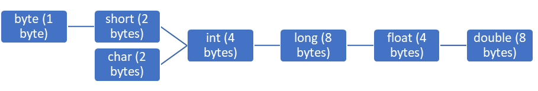
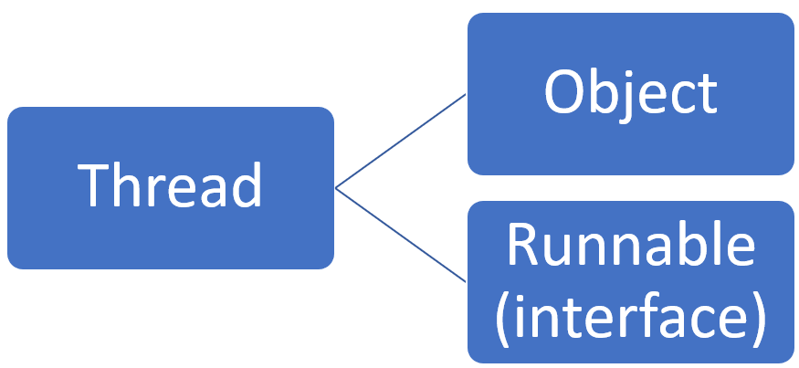
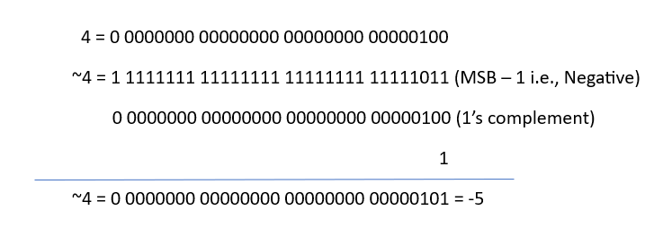

# Operators & Assignments
1. Increment and Decrement Operators
2. Arithmetic Operators
3. String Concatenation Operator
4. Relational Operators
5. Equality Operators
6. instanceof Operator
7. bitwise Operators
8. short circuit Operators
9. type cast Operator
10. assignment Operators
11. conditional Operator
12. new Operator
13. [] Operator
14. operator precedence
15. Evaluation Order of Operands
16. new Vs newInstance()
17. instanceof Vs isInstance()
18. ClassNotFoundException Vs NoclassDefFoundError

# Increment and Decerement Operators
|Expression|Initial Value of x|Value of y|Final Value of x|
|----------|:----------------:|:--------:|:--------------:|
|y = ++x;  |10                |11        |11              |
|y = x++;  |10                |10        |11              |
|y = --x;  |10                |9         |9               |
|y = x--;  |10                |10        |9               |

* We *can apply increment and decrement operators only for variables*. But, *not for constant values*. If we are *trying to apply for constant values*, then we *will get compile time error*.
```java
public class Main {
    public static void main(String[] args) {
        int x = 10;
        int y = ++10;
        System.out.println(y);
        /*
        error: unexpected type
        int y = ++10;
                  ^
  required: variable
  found:    value
        */
        int z = ++x;
        System.out.println(z);  //11
    }
}
```
* *Nesting of increment and decrement operators not allowed*.
```java
public class Main {
    public static void main(String[] args) {
        int x = 10;
        int y = ++(++x);
        System.out.println(y);
        /*
        error: unexpected type
        int y = ++(++x);
                   ^
  required: variable
  found:    value
        */
    }
}
```
* *For final variables*, we *can not apply increment and decrement operators*.
```java
public class Main {
    public static void main(String[] args) {
        final int x= 10;
        x++;
        System.out.println(x);
        /*
        error: cannot assign a value to final variable x
        x++;
        ^
        */
    }
}
```
* We *can apply increment and decrement operators for every primitve type except boolean*.
```java
public class Main {
    public static void main(String[] args) {
        int x = 10;
        x++;
        char ch = 'a';
        ch++;
        double d = 10.5;
        d++;
        boolean b = true;
        b++;
        System.out.println(x);  //11
        System.out.println(ch); //b
        System.out.println(d);  //11.5
        System.out.println(b);
        /*
        error: bad operand type boolean for unary operator '++'
        b++;
         ^
        */
    }
}
```
## Difference Between b++ and b = b+1
* *If we apply any arithmetic operator between 2 variables* a and b, the *result type is* always *max(int, type of a, type of b)*.
```java
public class Main {
    public static void main(String[] args) {
        byte a =10;
        byte b = 20;
        byte c = a+b;
        System.out.println(c);
        /*
        error: incompatible types: possible lossy conversion from int to byte
        byte c = a+b;
                  ^
        */
       byte d = (byte)(a+b);
       System.out.println(d);   //30 
    }
}
```
```java
public class Main {
    public static void main(String[] args) {
        byte b = 10;
        b = b+1;
        System.out.println(b);
        /*
        error: incompatible types: possible lossy conversion from int to byte
        b = b+1;
             ^
        */
        byte c = (byte)(b+1);
        System.out.println(c);  //11
    }
}
```
* But, *in case of increment and decrement operators*, *internal typecasting will be performed automatically*.
>>b++ => (type of b)(b+1)
```java
public class Main {
    public static void main(String[] args) {
        byte b = 10;
        b++;
        System.out.println(b);  //11
    }
}
```

# Arithmetic Operators (+, -, *, /, %)
* *If we apply any arithmetic operator between 2 variables* a and b, the *result type is* always *max(int, type of a, type of b)*.
>* byte+byte = int
>* byte+short = int
>* short+short = int
>* byte+long = long
>* long+double = double
>* float+long = float
>* char+char = int
>* char+double = double


```java
public class Main {
    public static void main(String[] args) {
        System.out.println('a'+'b');    //195
        System.out.println('a'+0.89);   //97.89
    }
}
```
## Infinity
* *In integral arithmetic* (byte, short, int, long) there is *no way to represent infinity*. Hence, *if infinity is the result*, we *will get arithmetic exception* in integral arithmetic.
```java
public class Main {
    public static void main(String[] args) {
        System.out.println(10/0);
        //Exception in thread "main" java.lang.ArithmeticException: / by zero
    }
}
```
* But, *in floating point arithmetic* (float and double) there *is a way to represent infinity*. For this *Float and Double classes contains following 2 constants POSITIVE_INFINTY and NEGATIVE_INFINITY*. Hence, even though result is infintiy, we won't get any arithemtic exception in floating point arithmetic.
```java
public class Main {
    public static void main(String[] args) {
        System.out.println(10/0.0); //Infinity
        System.out.println(-10/0.0); //-Infinity
    }
}
```
## NaN (Not a Number)
* *In integral arithmetic* (byte, short, int, long) there is *no way to represent undefined results*. Hence, *if the result is undefined*, we *will get runtime exception saying arithmetic exception by zero*.
```java
public class Main {
    public static void main(String[] args) {
        System.out.println(0/0);
        //Exception in thread "main" java.lang.ArithmeticException: / by zero
    }
}
```
* But, *in floating point arithemtic* (float and double), there *is a way to represent undefined results*. For this, *Float and Double classes contains Nan constant*. Hence, if the result is undefined, we won't get any arithmetic exception in floating point arithmetic.
```java
public class Main {
    public static void main(String[] args) {
        System.out.println(0.0/0);  //NaN
        System.out.println(-0.0/0);  //NaN
    }
}
```
**Note:** *For any x value including NaN*, the *following expressions returns false*.
>* x<NaN
>* x<=NaN
>* x>NaN
>* x>=NaN
>* x==NaN
*For any x value including NaN*, the *following expression returns true*.
>* x!=NaN
```java
public class Main {
    public static void main(String[] args) {
        System.out.println(10<Float.NaN);           //false
        System.out.println(10<=Float.NaN);          //false
        System.out.println(10>Float.NaN);           //false
        System.out.println(10>=Float.NaN);          //false
        System.out.println(10==Float.NaN);          //false
        System.out.println(Float.NaN==Float.NaN);   //false
        System.out.println(10!=Float.NaN);          //true
        System.out.println(Float.NaN!=Float.NaN);   //true
    }
}
```
## Arithmetic Exception
* It is *Runtime Exception* but *not compile time error*.
* It is *possible only in integral arithmetic* but *not in floating point arithmetic*.
* The only *operators which cause Arithmetic Excetion* are */* and *%*.

# String Concatenation Operator (+)
* The *only overloaded operator in java* is *+ operator*. *Sometimes* it *acts as arithmetic addition operator* and *sometimes* it *acts as string concatenation operator*.
* *If atleast 1 argument* is *string type*, then *+ operator acts as concatenation operator* and *if both arguments are number type*, then *+ operator acts as arithmetic addition operator*.
```java
public class Main {
    public static void main(String[] args) {
        String a = "rudra";
        int b = 10, c = 20, d = 30;
        System.out.println(a+b+c+d);    //rudra102030
        System.out.println(b+c+d+a);    //60rudra
        System.out.println(b+c+a+d);    //30rudra30
        System.out.println(b+a+c+d);    //10rudra2030
    }
}
```
```java
public class Main {
    public static void main(String[] args) {
        String a = "rudra";
        int b = 10, c = 20, d = 30;
        a = b+c+d;
        /*
        error: incompatible types: int cannot be converted to String
        a = b+c+d;
               ^
        */
        a = a+b+c;
        b = a+c+d;
        /*
        error: incompatible types: String cannot be converted to int
        b = a+c+d;
               ^
        */
        b = b+c+d;
        System.out.println(a);  //rudra1020
        System.out.println(b);  //60
    }
}
```
# Relational Operators (<, <=, >, >=)
* We *can apply relational operators for every primitive type, except boolean*.
```java
public class Main {
    public static void main(String[] args) {
        System.out.println(10<20);      //true
        System.out.println('a'<10);     //false
        System.out.println('a'<97.6);   //true
        System.out.println('a'>'A');    //true
        System.out.println(true>false);
        /*
        error: bad operand types for binary operator '>'
        System.out.println(true>false);
                               ^
  first type:  boolean
  second type: boolean
        */
    }
}
```
* We *can not apply relational operators for object types*.
```java
public class Main {
    public static void main(String[] args) {
        System.out.println("rudra">"RUDRA");
        /*
        error: bad operand types for binary operator '>'
        System.out.println("rudra">"RUDRA");
                                  ^
  first type:  String
  second type: String */
    }
}
```
* *Nesting of relational operators *is *not allowed*. *Otherwise*, we *will get compile time error*.
```java
public class Main {
    public static void main(String[] args) {
        System.out.println(10<20<30);   //true<30
        /*
        error: bad operand types for binary operator '<'
        System.out.println(10<20<30);
                                ^
  first type:  boolean
  second type: int
        */
    }
}
```
# Equality Operators (==, !=)
* We *can apply equality operators for every primitive type including boolean type also*.
```java
public class Main {
    public static void main(String[] args) {
        System.out.println(10==20);         //false
        System.out.println('a'=='b');       //false
        System.out.println('a'==97.0);      //true
        System.out.println(false==false);   //true
    }
}
```
* We *can apply equality operators for object types also*. *For object references* (r1, r2), *r1==r2 => true*, *if and only if both references pointing to the same object* (reference comparison or address comparison).
```java
public class Main {
    public static void main(String[] args) {
        Thread t1 = new Thread();
        Thread t2 = new Thread();
        Thread t3 = t1;
        System.out.println(t1==t2); //false
        System.out.println(t1==t3); //true
    }
}
```
* *If we apply equality operators for object types*, then *compulsory there should be some relation between argument types* (*either child to parent or parent to child or same type*). *Otherwise*, we *will get compile time error saying incomparable types*.
```java
public class Main {
    public static void main(String[] args) {
        Thread t = new Thread();
        Object o = new Object();
        String s = new String("Rudra");
        System.out.println(t==o);   //false
        System.out.println(o==s);   //false
        System.out.println(s==t);
        /*
        error: incomparable types: String and Thread
        System.out.println(s==t);
                            ^
        */
    }
}
```
* *For any object reference* r,* r==null* is* always false*. But, *null==null* is *always true*.
```java
public class Main {
    public static void main(String[] args) {
        String s = new String("rudra");
        String t = null;
        System.out.println(s==null);        //false
        System.out.println(t==null);        //true
        System.out.println(null==null);     //true
    }
}
```
## Difference Between == operator & .equals() method
* In general, we *can use == operator for reference comparison* (address comparison) and *.equals method for content comparison*.
```java
public class Main {
    public static void main(String[] args) {
        String s1 = new String("rudra");
        String s2 = new String("rudra");
        System.out.println(s1==s2);         //false
        System.out.println(s1.equals(s2));  //true
    }
}
```
# instanceof Operator
* We can use instance of operator to check whether the given object is of particular type or not.
```java
public class Main {
    public static void main(String[] args) {
        Object o = l.get(0);
        if(o instanceof Student){
            Student s = (Student)o;
            //Perform Student specific functionality
        }
        else if(o instanceof Customer){
            Customer c = (Customer)o;
            //Perform Customer specific functionality
        }
    }
}
```
* r instanceof x, where r is obkect reference, x is class or interface name.

```java
public class Main {
    public static void main(String[] args) {
        Thread t = new Thread();
        System.out.println(t instanceof Thread); // true
        //Because t is Thread object
        System.out.println(t instanceof Object); // true
        //Because every child object is by default parent type
        System.out.println(t instanceof Runnable); // true
        //Because every implemented class object is by default interface type
    }
}
```
* To use instanceof operator, compulsory there should be some relation between argument types (either child to parent or parent to child or same type). Otherwise, we will get compile time error saying incompatible types.
```java
public class Main {
    public static void main(String[] args) {
        Thread t = new Thread();
        System.out.println(t instanceof String);
        /*
        error: incompatible types: Thread cannot be converted to String
        System.out.println(t instanceof String);
                           ^
        */
    }
}
```
* For any class or interface x, null instance of x is always false.
```java
public class Main {
    public static void main(String[] args) {
        System.out.println(null instanceof String);     //false
        System.out.println(null instanceof Object);     //false
        System.out.println(null instanceof Runnable);   //false
    }
}
```
# Bitwise Operators (&, |, ^)
* & - AND - Returns true if and only if both arguments are true.
* | - OR - Returns true if and only if at least one argument is true.
* ^ - X-OR - Returns true if and only if both arguments are different.
```java
public class Main {
    public static void main(String[] args) {
        System.out.println(true&false); //false
        System.out.println(true|false); //true
        System.out.println(true^false); //true
    }
}
```
* We can apply these operators for integral types also.
```java
public class Main {
    public static void main(String[] args) {
        System.out.println(4&5); //4
        System.out.println(4|5); //5
        System.out.println(4^5); //1
    }
}
```
## Bitwise Complement Operator (~)
* We can apply this operator only for integral types, but not for, boolean type. If we are trying to apply for boolean type, then we will get compile time error.
```java
public class Main {
    public static void main(String[] args) {
        System.out.println(~true);
        /*
        error: bad operand type boolean for unary operator '~'
        System.out.println(~true);
                           ^
        */
       System.out.println(~4);  //-5
    }
}
```

* The most significant bit acts as sign bit. 0 means positive and 1 means negative number. Positive numbers will be represented directly in the memory whereas, negative numbers will be represented indirectly in the memory in 2's complement form.
## Boolean Complement Operator(!)
* We can apply these operator only for boolean types, but not for integral types.
```java
public class Main {
    public static void main(String[] args) {
        System.out.println(!4);
        /*
        error: bad operand type int for unary operator '!'
        System.out.println(!4);
                           ^
        */
       System.out.println(!false);  //true
    }
}
```
* &, |, ^ are applicable for both boolean and integral types.
* ~ is applicable for only integral types but not for boolean type.
* ! is applicable for only boolean type but not for integral types.
# short circuit Operators (&&, ||)
* These are exactly same as bitwise operators (&,|) except the following differences:

|&, \|  |&&, \|\|  |
|---|----|
|Both arguments should be evaluated always.|Second argument evaluation is optional.|
|Relatively Performance is low.|Relatively Performance is high.|
|Applicable for both boolean and integral types.|Applicable only for boolean, but not for integral types.|
* x&&y - y will be evaluated if and only if x is true, i.e., if x is false then y won't be evaluated.
* x||y - y will be evaluated if and only if x is false i.e., if x is true then y won't be evaluated.
```java
public class Main {
    public static void main(String[] args) {
        int x = 10, y = 15;
        int t1 = x, t2 = y;
        if (++t1<10 & ++t2>15) {
            t1++;
        } else {
            t2++;
        }
        System.out.println(t1+"..."+t2);    //11...17
        t1 = x;
        t2 = y;
        if (++t1<10 && ++t2>15) {
            t1++;
        } else {
            t2++;
        }
        System.out.println(t1+"..."+t2);    //11...16
        t1 = x;
        t2 = y;
        if (++t1<10 | ++t2>15) {
            t1++;
        } else {
            t2++;
        }
        System.out.println(t1+"..."+t2);    //12...16
        t1 = x;
        t2 = y;
        if (++t1<10 || ++t2>15) {
            t1++;
        } else {
            t2++;
        }
        System.out.println(t1+"..."+t2);    //12...16
    }
}
```
```java
public class Main {
    public static void main(String[] args) {
        int x = 10;
        if(++x<10 && (x/0>0)){
            System.out.println("Hello");
        }
        else{
            System.out.println("Hi");   //Hi
        }
    }
}
```
* If we replace && with &, then we will get runtime exception saying arithmetic exception division by zero.
# type cast Operators


# Assignment Operators
# Conditional Operator
# new Operator
# [] Operator
# Operator precedence
# Evaluation Order of Operands
# new Vs newInstance()
# instanceof Vs isInstance()
# ClassNotFoundException Vs NoclassDefFoundError


