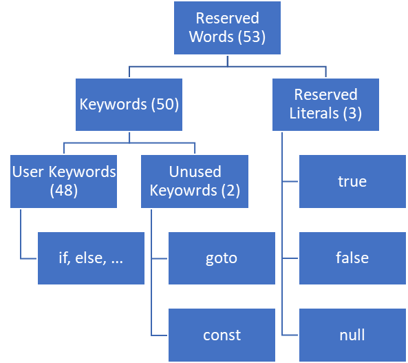
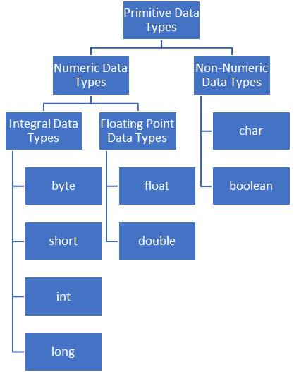
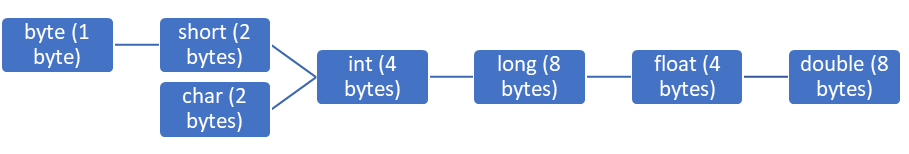
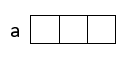

# Language Fundamentals
>1. Identifiers
>2. Reserved Words
>3. Data Types
>4. Literals
>5. Arrays
>6. Type Of Variables
>7. var-arg Methods
>8. main Method
>9. Command Line Arguments
>10. Java Coding Standards
---
# Identifiers
* A name in java program is considered as **Identifier** which can be *used for identification purpose*.
* It can be a *Class name, Method name, Variable name or Label name*.
```java
public class Temp {
    public static void main(String[] args) {
        int x = 10;
    }
}
```
>* *Test* - Class name
>* *Main* - Method name
>* *String* - Predefined Java Class name
>* *args* - Array name
>* *x* - Variable name

## Rules For Defining Java Identifiers
>1. The only allowed characters in java identifiers are:
>>* a to z
>>* A to Z
>>* 0 to 9
>>* $
>>* _

>>If we are using any other character, we will get compile time error.
>>>**Ex:**
>>>>total_number ✔  
>>>>total# ❌
>2. Identifiers can not starts with digit.
>>>**Ex:**
>>>>total123 ✔  
>>>>123total ❌
>3. Java identifiers are **case sensitive**. Ofcourse, Java language itself is treated as **case sensitive programming language**.
>>>**Ex:**
```java
public class Temp {
    public static void main(String[] args) {
        int number = 10;
        int Number = 20;
        int NUMBER = 30; //We can differentiate with respect to case
    }
}
```
>4. There is no length limit for java identifiers. But, it is not recommended to take too lengthy identifiers.
>5. We **can not use reserved words** as identifiers.
>>>**Ex:**
```java
public class Temp {
    public static void main(String[] args) {
        int x = 10; ✔
        int if = 20; ❌
    }
}
 ```
>6. All predefined java class names and interface names we can use as identifiers. 
>>>**Ex:**
```java
public class Temp {
    public static void main(String[] args) {
        int String = 10;
        System.out.println(String);
        int Runnable = 999;
        System.out.println(Runnable);
    }
}
```
>>Even though it is valid, but it is not a good programming practice. Because, it reduces readability and creates confusion.

1. Which of the following are valid java identifiers
>>>* total_number ✔
>>>* total# ❌
>>>* 123total ❌
>>>* total123 ✔
>>>* ca$h ✔
>>>* $__$____$ ✔
>>>* all@hands ❌
>>>* Java2Share ✔
>>>* Integer ✔
>>>* Int ✔
>>>* int ❌
---
# Reserved Words
* In java some words are reserved to represent some meaning or functionality are called Reserved Words.

## Keywords For Datatypes (8):
>* byte
>* short
>* int
>* long
>* float
>* double
>* boolean
>* char
## Keywords For Flow Control (11):
>* if
>* else
>* switch
>* case
>* default
>* while
>* do
>* for
>* break
>* continue
>* return
## Keywords For Modifiers (11):
>* public
>* private
>* protected
>* static
>* final
>* abstract
>* synchronized
>* native
>* strictfp (Version 1.2)
>* transient
>* volatile
## Keywords For Exceptional Handling (6):
>* try
>* catch
>* finally
>* throw
>* throws
>* assert (Version 1.4)
## Keywords For Class Related (6):
>* class
>* interface
>* extends
>* implements
>* package
>* import
## Keywords For Object Related (4):
>* new
>* instanceof
>* super
>* this
## Keyword For Return Type (1):
>* void

* In java return type is mandatory. If a method won't return anything, then we have to declare that method with void return type.
* But in C language, return type is optional and default return type in int.
## Unused Keywords:
### goto:
>Usage of goto created several problems in old languages and hence, SUN people banned this keyword in java.
### const:
>Use final instead of const.  

Note: goto and const are unused keywords. If we are trying to use, we will get compile time error.
## Reserved Literals:
>* true, false - values for boolean data type
>* null - default value for object reference
## enum Keyword:
>* It is released in version 1.5
>* We can use enum to define a group of named constants.
>**Ex:**
```java
 enum month{
        Jan, Feb, Mar, Apr, May, Jun, Jul, Aug, Sep, Oct, Nov, Dec
}
```
**Conclusions:**
* All 53 reserved words in java contains only lower case alphabet symbols.
* In java, we have only new keyword and there is no delete keyword because, destruction of useless objects is the responsibilty of garbage collector.
* The following are new keyowrds in java:
    * strictfp - version 1.2
    * assert - version 1.4
    * enum - version 1.5
* *strictfp* but not strictFp
* *instanceof* but not instanceOf
* *synchronized* but not synchronize
* *extends* but not extend
* *implements* but not implement
* *import* but not imports
* *const* but not constant
1. which of the following list contains only java reserved words?
>>* new, ~~delete~~
>>* goto, ~~constant~~
>>* break, continue, return, ~~exit~~
>>* final, finally, ~~finalize~~
>>* throw, throws, ~~thrown~~
>>* ~~notify, notifyall~~
>>* implements, extends, ~~imports~~
>>* ~~sizeof~~, instanceof
>>* ~~instanceOf, strictFp~~
>>* byte, short, ~~Int~~
>>* None of the above ✔

2. Which of the following are java reserved words?
>>* public ✔
>>* static ✔
>>* void ✔
>>* main - name of the method
>>* String - its a predefined class
>>* args  -  name of the variable

# Data Types
* In java, every variable and every expression has some type.
* Each and every data type is clearly defined.
* Every assignment should be checked by compiler for type compatibility.
* Because of above reasons, we can conclude java language is **strongly typed programming language**.
* Java is not considered as **pure object oriented programming language because, several OOP features are not satisfied** by java (like Operator Overloading, Multiple Inheritance, etc).
* Moreover, we are depending on primitive data types which are non-objects.
## Primitive Data Types

* Except *boolean and char, remaining data types* are considered as *signed data* types because, we can represent both positive and negative numbers.
### byte:
* size: 1 byte (8 bits)
* MAX_Value: +127
* MIN_Value: -128
* Range: -128 to 127

 
* The most significant bit act as sign bit.
* 0 means +ve number and 1 means -ve number
* Positive number will be represented directly in a memory, whereas negative numbers will be represented in 2's complement form.
```java
public class Temp {
     public static void main(String[] args) {
          byte b = 10;
          System.out.println(b); //10
          byte c =127;
          System.out.println(c); //127
          byte d = 128;
          /*
          error: incompatible types: possible lossy conversion from int to byte
          byte d = 128;
                   ^
          */
          byte e = 10.5;
          /*
          error: incompatible types: possible lossy conversion from double to byte
          byte e = 10.5;
                   ^
           */
          byte f = true;
          /*
          error: incompatible types: boolean cannot be converted to byte
          byte f = true;
                   ^
           */
          byte g = "rudra";
          /*
          error: incompatible types: String cannot be converted to byte
          byte g = "rudra";
                   ^
           */
     }
}
```
* *Byte* is the best choice if we want to handle data in terms of *streams* either from the file or from the network (File supported form or network supported form is byte).
### short:
* This is the most rarely used data type in java.
* size: 2 byte (16 bits)
* Range: -2<sup>15</sup> to 2<sup>15</sup>-1 => [-32768 to 32767]
```java
public class Temp {
    public static void main(String[] args) {
        short s = 32767;
        System.out.println(s);
        short t = 32768;
        /*
        error: incompatible types: possible lossy conversion from int to short
        short t = 32768;
                  ^
         */
        short u = 10.5;
        /*
        error: incompatible types: possible lossy conversion from double to short
        short u = 10.5;
                  ^
         */
        short v = true;
        /*
        error: incompatible types: boolean cannot be converted to short
        short v = true;
                  ^
         */
    }
}
```
* Short data type is best *suitable for 16-bit processors* like 8085. But, the processors are completely outdated and hence, corresponding short data type is also outdated data type.
### int
* The most commonly used data type in java is int.
* size: 4 bytes (32 bits)
* Range: -2<sup>31</sup> to 2<sup>31</sup>-1 => [-2147483648 to 2147483647]
### long
* Sometimes int may not enough to hold big values, then we should go for long type.

**Ex:**
1. The amount of distance travelled by light in 1000 days, to hold this value int may not enough. We should go for long data type.
>>>long l = 126000 * 60 * 60 * 24 *1000
2. The number of characters present in a big file may exceed int range. Hence, the return type of length method is long (but not int).
>>>long l = f.length()
* size: 8 bytes (64 bits)
* Range: -2<sup>63</sup> to 2<sup>63</sup>-1

**Note:**
* All the above data types(byte, short, int, long) meant for representing integral values.
* If we want to represent floating point values, then we should go for floating point data types.
## Floating Point Data Types
|                   |**float**         |**double**          |
|-------------------|:-----------------|--------------------|
|Accuracy           |5 to 6            |14 to 15            |
|Following Precision|Single Precision  |Double Precision    |
|Size               |4 bytes           |8 bytes             |
|Range              |-3.4e38 to 3.4e38 |-1.7e308 to 1.7e308 |
### boolean Data Type
* Size: Not applicable (virtual Machine Dependent)
* Range: Not applicable (But allowed values are true or false)
```java
public class Temp {
    public static void main(String[] args) {
        boolean b = true;
        boolean c = 0;
        /*
        error: incompatible types: int cannot be converted to boolean
        boolean c = 0;
                    ^
        */
       boolean d = True;
       /*
           error: cannot find symbol
           boolean d = True;
                       ^
        symbol:   variable True
        location: class Temp
       */
        boolean e = "True";
        /*
        error: incompatible types: String cannot be converted to boolean
        boolean e = "True";
        */
    }
}
```
```java
public class Temp {
    public static void main(String[] args) {
        int x = 0;
        int y = 1;
        if (x) {
            System.out.println("Hello");
        }
        else{
            System.out.println("Hi");
        }
        /*
        error: incompatible types: int cannot be converted to boolean
        if (x) {
            ^
        */
        while (y) {
            System.out.println("Bye");
        }
        /*
        error: incompatible types: int cannot be converted to boolean
        while (y) {
               ^
        */
    }
}
```
### char Data Type
* *Old languages (like C/C++)* are *ASCII* code based and the number of different allowed ASCII code characters are <= 256.
* To represent these 256 characters, 8 bits are enough. Hence, the size of char in old languages is 1 byte (8 bits).
* But **java** is **unicode** based and the number of different unicode characters are greater than 256 and less than or equal to 65536.
* To represent, these many characters 8 bits may not enough and compulsory we should go for 16 bits.
* Hence, the size of char is 2 bytes.
* size: 2 bytes
* Range: 0 to 65535
### Summary of Java Primitive Data Types
|Data Type|Size   |Range                                                                  |Wrapper Class|Default Value|
|---------|-------|-----------------------------------------------------------------------|-------------|-------------|
|byte     |1 byte |-2<sup>7</sup> to 2<sup>7</sup>-1 (128 to 127)                         |Byte         |0            |
|short    |2 bytes|-2<sup>15</sup> to 2<sup>15</sup>-1 (-32768 to 32767)                  |Short        |0            |
|int      |4 bytes|-2<sup>31</sup> to 2<sup>31</sup>-1 (-2147483648 to 2147483647)        |Integer      |0            |
|long     |8 bytes|-2<sup>63</sup> to 2<sup>63-1                                          |Long         |0            |
|float    |4 bytes|-3.4e38 to 3.4e38                                                      |Float        |0.0          |
|double   |8 bytes|-1.7e308 to 1.7e308                                                    |Double       |0.0          |
|boolean  |NA     |NA (But allowed values are true/false)                                 |Boolean      |false        |
|char     |2 bytes|0 to 65535                                                             |character    |" "          |

Note: *null* is the *default value for object reference* and we *can not apply for primitives*. If we are trying to use for primitive, then we will get compile time error.
```java
public class Temp {
    public static void main(String[] args) {
        char ch = null;
        /*
        error: incompatible types: <null> cannot be converted to char
        char ch = null;
                  ^
        */
    }
}
```
## Literals
* A constant value which can be assigned to the variable is called literal.  
**Ex:**  
>>>>int x = 10;

>>int - data type/keyword  
>>x - name of variable/identifier  
>>10 - constant value/literal

### Integral Literals
* For integral data types (byte, short, int, long), we can specify literal value in the following ways.
1. Decimal Literals (Base - 10)
>* Allowed digits are 0 to 9.  
**Ex:**
>>>>int x = 10;
2. Octal Literals (Base - 8)
>* Allowed digits are 0 to 7.
>* Literal value should be prefixed with 0.  
**Ex:**
>>>>int x = 010;
3. Hexadecimal Form (Base - 16)
>* Allowed digits are 0 to 9, a to f.
>* For extra digits (a to f), we can use both lower case and upper case characters. This is one of very few areas very java is not case sensitive.
>* The literal value should be prefixed with *0x* or *0X*.  
**Ex:**
>>>>int x = 0x10;
* These are only possible ways to specify literal value for integral data types.
```java
public class Temp {
    public static void main(String[] args) {
        int x = 10;         //valid
        int y = 0786;      //invalid
        /*
        error: illegal digit in an octal literal
        int y = 0786;
                  ^
        */
        int z = 0777;       //valid
        int a = 0XFace;     //valid
        int b = 0XBeef;     //valid
        int c = 0XWack;     //invalid
        /*
        error: hexadecimal numbers must contain at least one hexadecimal digit
        int c = 0XWack;
                ^
        error: ';' expected
        int c = 0XWack;
                  ^
        */
    }
}
```
* By default every integral literal is of int type.
```java
public class Temp {
    public static void main(String[] args) {
        int x = 10;
        int y = 010;
        int z = 0X10;
        System.out.println(x+"...."+y+"...."+z);
        //10....8....16
    }
}
```
* But, we can specify explicitly as long type by suffixed with 'l' or 'L'.
```java
public class Temp {
    public static void main(String[] args) {
        int x = 10;
        long y = 010L;
        long l =10;
        /*
        error: incompatible types: possible lossy conversion from long to int
        int z = 0X10L;
                ^
        */
       int z = 0X10L;
    }
}
```
* There is no direct way to specifying byte and short literals explicitly.
* But, indirectly we can specify.
* Whenever we are assigning integral literal to the byte varialbe and if the variable within the range of byte then, compiler treats it automatically as byte literal.
* Similarly, short literal also.
 ```java
 public class Temp {
    public static void main(String[] args) {
        byte b = 10;
        byte c = 127;
        byte d = 128;
        /*
        error: incompatible types: possible lossy conversion from int to byte
        byte d = 128;
                 ^
        */
        short s = 32767;
        short t = 32768;
        /*
        error: incompatible types: possible lossy conversion from int to short
        short t = 32768;
                  ^
        */
    }
}
```
### Floating Point Literals
* By default, every floating point literal is of double type.
* Hence, we can not assign directly to the float variable.
* But, we can specify floating point literal as float type by suffixed with 'f' or 'F'.
```java
public class Temp {
    public static void main(String[] args) {
        float f = 123.456;
        /*
        error: incompatible types: possible lossy conversion from double to float
        float f = 123.456;
                  ^
        */
       float g = 123.456F;
       double d = 123.456;
    }
}
```
* We can specify explicitly floating point literal as double type by suffixed with 'd' or 'D'.
* Of course, these convention is not required.
```java
public class Temp {
    public static void main(String[] args) {
       double d = 123.456D;
       System.out.println(d);   //123.456
       float e = 123.456D;
       /*
       error: incompatible types: possible lossy conversion from double to float
       float e = 123.456D;
                 ^
       */
    }
}
```
* We can specify floating point literals only in decimal form and we can not specify in octal and hexadecimal forms.
```java
public class Temp {
    public static void main(String[] args) {
       double d = 123.456D;
       double e = 0123.456;
       System.out.println(e);   //123.456
       double f = 0X123.456;
       /*
       error: malformed floating-point literal
       double f = 0X123.456;
                  ^
       */
    }
}
```
* We can assign integral literal directly to floating point variables and that integral literal can be specified either in decimal or octal or hexadecimal forms.
```java
public class Temp {
    public static void main(String[] args) {
        double d = 10;
        System.out.println(d); // 10
        double e = 0XFace;
        System.out.println(e); // 64206.0
        double f = 0786.0;
        System.out.println(f); // 786.0
        double g = 0786;
        /*
        error: illegal digit in an octal literal
        double g = 0786;
                     ^
        */
        double h = 0XFace.0;
        /*
        error: malformed floating-point literal
        double h = 0XFace.0;
                   ^
         */
        double i = 0777;
        System.out.println(i);  //511.0
    }
}
```
* We can not assign floating point literals to integral types.
```java
public class Temp {
    public static void main(String[] args) {
        double d = 10;
        int x = 10.0;
        /*
        error: incompatible types: possible lossy conversion from double to int
        int x = 10.0;
                ^
        */
    }
}
```
* We can specify the floating point literal even in exponential form (scientific notation).
```java
public class Temp {
    public static void main(String[] args) {
        double d = 1.2e3;
        System.out.println(d);      //1200.0
        float e = 1.2e3f;
        System.out.println(e);      //1200.0
        float f = 1.2e3;
        /*
        error: incompatible types: possible lossy conversion from double to float
        float f = 1.2e3;
                  ^
        */
    }
}
```
### Boolean Literals
* The only allowed values for boolean data type are true/false.
```java
public class Temp {
    public static void main(String[] args) {
        boolean b = true;
        boolean c = 0;
        /*
        error: incompatible types: int cannot be converted to boolean
        boolean c = 0;
                    ^
        */
        boolean d = True;
        /*
        error: cannot find symbol
        boolean d = True;
                    ^
  symbol:   variable True
  location: class Temp
        */
        boolean e = "true";
        /*
        error: incompatible types: String cannot be converted to boolean
        boolean e = "true";
                    ^
        */
    }
}
```
```java
public class Temp {
    public static void main(String[] args) {
        int x = 0;
        int y = 1;
        if (x) {
            System.out.println("Hello");
        }
        else{
            System.out.println("Hi");
        }
        /*
        error: incompatible types: int cannot be converted to boolean
        if (x) {
            ^
        */
        while (y) {
            System.out.println("Bye");
        }
        /*
        error: incompatible types: int cannot be converted to boolean
        while (y) {
               ^
        */
    }
}
```
### Char Literals
* We can specify char literal as single character within single quotes.
```java
public class Temp {
    public static void main(String[] args) {
        char c = 'a';
        char d = a;
        /*
        error: cannot find symbol
        char d = a;
                 ^
  symbol:   variable a
  location: class Temp
        */
        char e = "a";
        /*
        error: incompatible types: String cannot be converted to char
        char e = "a";
                 ^
        */
        char f = 'ab';
        /*
        error: unclosed character literal
        char f = 'ab';
                 ^
        error: unclosed character literal
        char f = 'ab';
                    ^
        error: not a statement
        char f = 'ab';
                   ^
        */
    }
}
```
* We can specify char literal as integral literal which represents unicode value of the character and that integral literal can be specified either in decimal or octal or hexadecimal forms.
* But, allowed range is 0 to 65535.
```java
public class Temp {
    public static void main(String[] args) {
        char c = 97;
        System.out.println(c);  //a
        char d = 0XFace;
        System.out.println(d);  //?
        char e = 0777;
        System.out.println(e);  //?
        char f = 65535;
        System.out.println(f);  //?
        char g = 65536;
        /*
        error: incompatible types: possible lossy conversion from int to char
        char g = 65536;
                 ^
        */
    }
}
```
* We can represent char literal in unicode representation which is nothing but '\uxxxx' where 'xxxx' is 4-digit hexadecimal number.
```java
public class Temp {
    public static void main(String[] args) {
        char c = '\u0061';
        System.out.println(c);  //a
    }
}
```
* Every escape character is a valid char literal.
```java
public class Temp {
    public static void main(String[] args) {
        char c = '\n';
        char d = '\t';
        char e = '\m';
        /*
        error: illegal escape character
        char e = '\m';
                   ^
        */
    }
}
```
|Escape Character|Description     |
|----------------|----------------|
|\n              |New line        |
|\t              |Horizontal tab  |
|\r              |Carriage return |
|\b              |Back space      |
|\f              |Form Feed       |
|\'              |Single quote    |
|\"              |Double quote    |
|\\\             |Back slash      |


1. Which of the following are valid?
>>* char ch = 65536;   ❌
>>* char ch = 0XBeer;   ❌
>>* char ch = \uface;   ❌
>>* char ch = '\ubeef';     ✔
>>* char ch = '\m';     ❌
>>* char ch = '\iface';     ❌
### String Literal
* Any sequence of characters within double quotes is treated as string literal.
```java
public class Temp {
    public static void main(String[] args) {
        String s = "Rudra";
    }
}
```
### 1.7 Version Enhancements W.R.T Literals
#### 1. Binary Literals
* For integral data types, until 1.6 version we can specify literal value in the following ways (Decimal, Octal, Hexa Decimal Form).
* But from 1.7 version onwards, we can specify literal value even in binary form also.
* Allowed digits are 0 and 1.
* Literal value should be prefixed with '0b' or '0B'.
```java
public class Temp {
    public static void main(String[] args) {
        int x = 0b1111;
        System.out.println(x);      //15
    }
}
```
#### 2. Usage of _ Symbol in Numeric Literals
* From 1.7 version onwards, we can use '_' symbol between digits of numeric literal.
* The main advantage of this approach is readability of the code will be improved.
```java
public class Temp {
    public static void main(String[] args) {
        double d = 123456.789;      //123456.789
        double e = 123_456.7_8_9;   //123456.789
        System.out.println(d);
        System.out.println(e);
    }
}
```
* At the time of compilation, these '_' will be removed automatically. Hence, after compilation the above lines will become "double d = 123456.789;".
* We can use more than one '_' also between the digits.
```java
public class Temp {
    public static void main(String[] args) {
        double d = 1__23_4_5__6.7_8_9;
        double e = 1_2__3___4____5_____6.7_8_9;
        System.out.println(d);      //123456.789
        System.out.println(e);      //123456.789
    }
}
```
* We can use '_' symbol only between the digits. If we are using anywhere else, we will get compile time error.
```java
public class Temp {
    public static void main(String[] args) {
        double d = _1_2_3456.7_8_9;
        /*
        error: ';' expected
        double d = _1_2_3456.7_8_9;
                            ^
        */
       double e = 1_23_456_.789;
       /*
       error: illegal underscore
       double e = 1_23_456_.789;
                          ^
       */
      double f = 1_23_456.7_8_9_;
      /*
      error: illegal underscore
      double f = 1_23_456.7_8_9_;
                               ^
       */
    }
}
```

* 8 byte long value, we can assign to 4 byte float variable. Because, both are following different memory representations internally.
```java
public class Temp {
    public static void main(String[] args) {
        float f = 10l;
        System.out.println(f);  //10.0
    }
}
```
* short data type can not be assigned to char. Because, short data can not hold maximum value of char.
* char data type can not be assigned to short. Because, char data can not hold -ve sign.

# Arrays
>1. Introduction
>2. Array declaration
>3. Array creation
>4. Array initialization
>5. Array declaration, creation, initialization in a single line
>6. length vs length()
>7. Anonymous arrays
>8. Array element assignments
>9. Array variable assignments
## Introduction
* An array is an indexed collection of fixed number of homogenous data elements.
* The main advantage of array is we can represent huge number of values by using single variable. So that, readability of the code will be improved.
* But, the main disadvantage of array is fixed in size i.e., once we creates an array, there is no chance of increasing or decreasing the size based on our requirement. Hence, to use array concept, compulsory we should know the size in advance, which may not possible always.
## Array Declaration
### 1-Dimensional Array Declaration
```java
int[] x;    //Recommended and valid
int []x;    //valid
int x[];    //valid
```
* *int[] x;* is recommended because the name is clearly separated from type.
* At the time of declaration, we can not specify the size. Otherwise, we will get compile time error.
```java
public class Temp {
    public static void main(String[] args) {
        int[6] x;       ❌
        /*
        error: ']' expected
        int[6] x;
            ^
        error: not a statement
        int[6] x;
           ^
        error: not a statement
        int[6] x;
               ^    
        */
        int[] y;        ✔
    }
}
```
### 2-Dimensional Array Declaration
```java
public class Temp {
    public static void main(String[] args) {
        int[][] x;      //valid
        int [][]y;      //valid
        int z[][];      //valid
        int[] []a;      //valid
        int [] b[];     //valid
        int []c[];      //valid
    }       
}
```
```java
public class Temp {
    public static void main(String[] args) {
        int[] a, b;     //a - 1D, b - 1D
        int[] c[], d;   //a - 2D, b - 1D
        int[] e[], f[]; //a - 2D, b - 2D
        int[] []g, h;   //a - 2D, b - 2D
        int[] []i,j[];  //a - 2D, b - 3D
        int[] []k, []l; 
        /*
        error: <identifier> expected
        int[] []k, []l;
                  ^
        error: ';' expected
        int[] []k, []l;
                     ^
         */
    }
}
```
* If we want to specify dimension before the variable, that facility is applicable only for first variable in a declaration.
* If we are trying to apply for remaining variables, we will get compile time error.
```java
public class Temp {
    public static void main(String[] args) {
        int[] []a, []b, []c;
        /*
        a - ✔
        b - ❌
        c - ❌
        */
    }
}
```
### 3-Dimensional Array Declaration
```java
public class Temp {
    public static void main(String[] args) {
        int[][][] a;    //valid
        int [][][]b;    //valid
        int c[][][];    //valid
        int[] [][]d;    //valid
        int[] e[][];    //valid
        int[] []f[];    //valid
        int[][] []g;    //valid
        int[][] h[];    //valid
        int [][]i[];    //valid
        int []j[][];    //valid
    }
}
```
## Array Creation
* Every array in java is an object only. Hence, we can create array by using new operator.
**Ex:**
```java
public class Temp {
    public static void main(String[] args) {
        int[] a = new int[3];
    }
}
```
>>>>>>>>>
* For every array type, corresponding classes are available and these classes are part of java language and not available to the programmer level.
```java
public class Temp {
    public static void main(String[] args) {
        int[] a = new int[3];
        System.out.println(a.getClass().getName()); //[I
    }
}
```
|Array Type|Corresponding Class Name|
|----------|------------------------|
|int[]     |[I                      |
|int[][]   |[[I                     |
|double[]  |[D                      |
|short[]   |[S                      |
|byte[]    |[B                      |
|boolean[] |[Z                      |
1. At the time of array creation, compulsory we should specify the size. Otherwise, we will get compile time error.
```java
public class Temp {
    public static void main(String[] args) {
        int[] a = new int[3];
        int[]b = new int[];
        /*
        error: array dimension missing
        int[]b = new int[];
                          ^
        */
    }
}
```
2. It is legal to have an array with size 0 in java.
```java
public class Temp {
    public static void main(String[] args) {
        int[] x = new int[0];
    }
}
```
3. If we are trying to specify array size with some negative int value, then we will get runtime exception saying negative array size exception.
**Ex:**
```java
public class Temp {
    public static void main(String[] args) {
        int[] x = new int[-6];
        /*
        Exception in thread "main" java.lang.NegativeArraySizeException: -6
        at Temp.main(Temp.java:3)
        */
    }
}
```
4. To specify array size, the allowed data types are byte, short, char, int. If we are trying to specify any other type, then we wil get compile time error.
**Ex:**
```java
public class Temp {
    public static void main(String[] args) {
        int[] a = new int[10];
        int[] b = new int['b'];
        byte g = 20;
        int[] c = new int[g];
        short d = 30;
        int[] e = new int[d];
        int[] f = new int[10l];
        /*
        error: incompatible types: possible lossy conversion from long to int
        int[] f = new int[10l];
                          ^
        */
    }
}
```
5. The maximum allowed array size in java is 21474843647 which is the maximum value of int data type.
```java
public class Temp {
    public static void main(String[] args) {
        int[] a = new int[2147483647];
        int[] b = new int[2147483648];
        /*
        error: integer number too large
        int[] b = new int[2147483648];
                          ^
        */
    }
}
```
6. Even in the first case, we may get runtime exception if sufficient heap memory not available.
### 2-Dimensional Array Creation
* In java, 2-D array not implemented by using matrix style. Sun people followed array of arrays approach for multi-dimensional array creation.
* The main advantage of this approach is memory utilization will be improved.
**Ex1: Memory Structure and Corresponding Java Code**
```java
public class Temp {
    public static void main(String[] args) {
        int[][] x = new int[2][];
        x[0] = new int[2];
        x[1] = new int[3];
    }
}
```
**Ex2: To create 2D Array of various sizes**
```java
public class Temp {
    public static void main(String[] args) {
        int[][][] x = new int[2][][];
        x[0] = new int[3][];
        x[0][0] = new int[1];
        x[0][1] = new int[2];
        x[0][2] = new int[3];
        x[1] = new int[2][2];
    }
}
```
Q. Which of the following array declarations are valid?
>* int[] a = new int[];            ❌    
>* int[] a = new int[3];           ✔
>* int[][] a = new int[][];        ❌
>* int[][] a = new int[3][];       ✔
>* int[][] a = new int[][4];       ❌
>* int[][] a = new int[3][4];      ✔
>* int[][][] a = new int[3][4][5]; ✔
>* int[][][] a = new int[3][4][];  ✔
>* int[][][] a = new int[3][][5];  ❌
>* int[][][] a = new int[][4][5];  ❌
### Array Initialization
* Once we creates an array, every element by default initialized with default values.
```java
public class Temp {
    public static void main(String[] args) {
        int[] x = new int[3];
        System.out.println(x);      //[I@251a69d7
        System.out.println(x[0]);   //0
    }
}
```
**Note:** Whenever we are trying to print any reference variable, internally 2 string method will be called which is implemented by default to return the string in following form "classname@hashcode_in_hexadecimal_form".
```java
public class Temp {
    public static void main(String[] args) {
        int[][] x = new int[2][3];
        System.out.println(x);      //[[I@251a69d7
        System.out.println(x[0]);   //[I@7344699f
        System.out.println(x[0][0]);//0
    }
}
```
```java
public class Temp {
    public static void main(String[] args) {
        int[][] x = new int[2][];
        System.out.println(x);      //[[I@251a69d7
        System.out.println(x[0]);   //null
        System.out.println(x[0][0]);
        /*
        Exception in thread "main" java.lang.NullPointerException: Cannot load from int array because "<local1>[0]" is null       
        at Temp.main(Temp.java:6)
        */
    }
}
```
**Note:** If we are trying to perform any operation on null, then we will get runtime exception saying null pointer exception.
* Once we creates an array, every array element by default initialized with default values. If we are not satisfied by default values then we can overwrite these values with our customized values.
```java
public class Temp {
    public static void main(String[] args) {
        int[] x = new int[6];
        x[0] = 10;
        x[1] = 20;
        x[2] = 30;
        x[3] = 40;
        x[4] = 50;
        x[5] = 60;
    }
}
```
>>>>
```java
public class Temp {
    public static void main(String[] args) {
        int[] x = new int[6];
        x[0] = 10;
        x[1] = 20;
        x[2] = 30;
        x[3] = 40;
        x[4] = 50;
        x[5] = 60;
        x[6] = 70;
        /*
        Exception in thread "main" java.lang.ArrayIndexOutOfBoundsException: Index 6 out of bounds for length 6
        at Temp.main(Temp.java:10)
        */
       x[-6] = 80;
       /*
       Exception in thread "main" java.lang.ArrayIndexOutOfBoundsException: Index -6 out of bounds for length 6
        at Temp.main(Temp.java:15)
        */
       x[2.5] = 90;
       /*
       error: incompatible types: possible lossy conversion from double to int
       x[2.5] = 90;
         ^
       */
    }
}
```
**Note:** If we are trying to access array element with out of range index (either positive value or negative int value) then we will get run time exception saying array index out of bounds exception.


